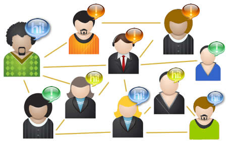

# 1.1. DEFINICIÓN

Fig. 7.2 Día internet. Redes sociales. Autor: losdelmamo. Fuente: [http://www.flickr.com/photos/periodismoucscgeneracion2000/2471457835/](http://www.flickr.com/photos/periodismoucscgeneracion2000/2471457835/) CC

 

En realidad, el **concepto de red social **no es nuevo. Las personas somos seres sociales que desde nuestro nacimiento establecemos relaciones con otras personas de nuestro entorno. Estas relaciones son de distinto tipo en función de con quienes con relacionemos o cual sea la finalidad de dicha relación, así podemos pertenecer a distintos grupos sociales según establezcamos lazos de parentesco, de amistad, por compartir alguna experiencia, por coincidir en un determinado espacio-tiempo, etc.

Podemos decir, por tanto, que **una red social es una estructura social formada por personas o entidades conectadas y unidas entre sí por algún tipo de interés común**. Este concepto ha sido estudiado durante décadas desde diferentes disciplinas: antropología, sociología, matemáticas aplicadas,... y sobre él se han elaborado numerosas teorías, muchas de las cuales sirven para entender e interpretar también el funcionamiento de las redes sociales en Internet.

## importante

**Las redes sociales en Internet** aportan un matiz diferente respecto al concepto habitual de red social, ya que **nos permiten establecer relaciones reales con otras personas en un entorno virtual**, sin estar presentes físicamente, lo que en muchos casos supone llegar a establecer contacto de forma sencilla con personas que de otra forma serían inaccesibles o desconocidas para nosotros. Amplía, por tanto, nuestras opciones de interacción con personas afines a nuestros intereses, lo que hace que las relaciones sociales: personales y profesionales se vayan enriqueciendo, porque **no se trata sólo de estar en contacto con gente, si no de facilitar el compartir e intercambiar información, datos, recursos y experiencias entre los miembros de esa red.**

https//www.youtube.com/watch?v=nFEVJ2eRSv8

## parasabermas

Las siguientes teorías son aplicadas a la interpretación y desarrollo de las redes sociales en Internet:

* Teoría de grafos y sus aplicaciones (sociograma de una red social): [**http://es.wikipedia.org/wiki/Teor%C3%ADa_de_grafos**](http://es.wikipedia.org/wiki/Teor%C3%ADa_de_grafos)

*  Teoría de los seis grados de Ducan Watts: [**http://es.wikipedia.org/wiki/Seis_grados_de_separaci%C3%B3**](http://es.wikipedia.org/wiki/Seis_grados_de_separaci%C3%B3)

* Experimento del mundo pequeño: [**http://es.wikipedia.org/wiki/Experimento_del_Mundo_Peque%C3%B1o**](http://es.wikipedia.org/wiki/Experimento_del_Mundo_Peque%C3%B1o)

