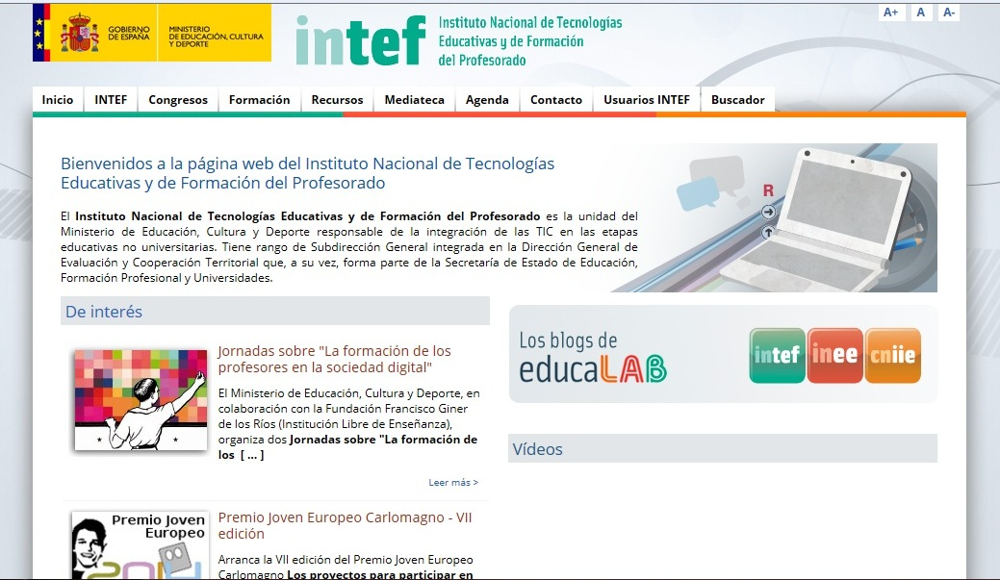
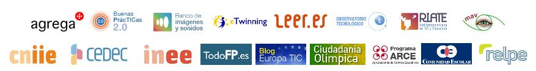

# 1.1.- PORTAL DEL INTEF

El** Instituto Nacional de Tecnologías de la Educación y Formación del Profesorado** ( [INTEF](http://www.ite.educacion.es/)) es el organismo dependiente del Ministerio de Educación Cultura y Deporte responsable de la integración de las TIC en las etapas educativas no universitarias.

En el portal del INTEF podemos diferenciar varias partes:

El **menú horizontal** desde el que podemos acceder a los apartados más importantes: INTEF, congresos, formación, recursos, mediateca, agenda, contacto, usuarios INTEF y buscador.

La **presentación**: Justo debajo del menú, se explica qué es INTEF y de quién depende.

**De interés**: Sección que queda en la columna de la izquierda, desde donde nos enlazan con algunas convocatorias o anuncios destacados.

**Últimas noticias**: También a la izquierda, debajo del apartado anterior, está la sección donde se recogen las últimas noticias publicadas en esta web.

**Blogs**: En la columna superior derecha hay un apartado "Educalab" que enlaza con los blogs de INTEF, INEE (Instituto Nacional de Evaluación Educativa) y CNIIE (Centro Nacional de Investigación e Innovación Educativa). En todo ellos podremos encontrar artículos (posts)muy interesantes y también podemos seguirles en Twitter (@educalab).

**Vídeos:** Debajo de los blogs, nos muestra una selección de vídeos relacionados con educación.

**Twitter:** Abajo a la derecha, aparecen los tweets de las cuentas que sigue @educalab.

Abajo del todo aparecen las páginas de los programas o **plataformas más importantes de INTEF**: Agrega, Leer.es, eTwinning, banco de imágenes y sonidos, CEDEC, etc.  más adelante veremos algunos de ellos.

