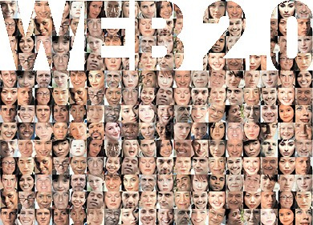

# 1.1. PRINCIPIOS

 Como se ha visto en el apartado anterior, fue **Tim O´Reilly** quien acuñó el término web 2.0, y apoyó su idea de un nuevo enfoque de la web a partir de la comparación con (a partir de entonces) la web 1.0. Entre sus conclusiones hablaba de los  **7 principios de la Web 2.0**:

1. La Web como plataforma
1. Aprovechar la inteligencia colectiva
1. Los datos son el nuevo microprocesador
1. El fin de la etapa de lanzamiento de software- el beta permanente.
1. Modelos de programación ligeros
1. El software supera el límite de un único dispositivo
1. Una experiencia de usuario enriquecida

Estos **principios** vienen **desglosados y explicados** de una forma muy interesante en el siguiente enlace:

[http://www.ite.educacion.es/formacion/materiales/155/cd/modulo_1_Iniciacionblog/principios_generales_de_la_web_20.html](http://www.ite.educacion.es/formacion/materiales/155/cd/modulo_1_Iniciacionblog/principios_generales_de_la_web_20.html)

