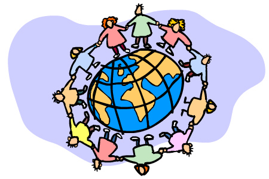

# 1.2. CARACTERÍSTICAS DE INTERNET

Actualmente[^1], un 47 % de la población mundial, utiliza Internet. Esto supone que hay unos 2.700 millones de personas que se conectan a la red y, a través de diferentes dispositivos (ordenadores, tabletas, smartphones, relojes y gafas inteligentes,...), disfrutan de las diferentes actividades que les ofrece. **Las posibilidades de acción que ofrece ahora Internet han ido evolucionando con el tiempo**, hasta disponer de un amplio abanico de posibilidades: publicar y/localizar información, enviar mails, comunicarse vía chats, comercio a través de la red, blogs, redes sociales, formación, etc. Tal es el volumen de actividad de Internet, que cada minuto se suben 700 vídeos, se publican 100.000 tuits y se marcan 34.000 "me gusta" en Facebook.

[^1]: Septiembre de 2.013.

Sólo se puede entender este enorme desarrollo, si analizamos las características de Internet:

- **Universal:** Internet está extendida prácticamente por todo el mundo. Desde cualquier país podemos ver información generada en los puntos más alejados del planeta, enviar correo electrónico de una punta a otra del globo, comprar, transferir archivos, etc.

 

- **Global:** Internet integra gente de todas las profesiones, nacionalidades, creencias religiosas, culturas, edades y niveles de preparación, tales como empresas, instituciones educativas y gubernamentales, profesionales independientes, organizaciones regionales e internacionales, y gente con todo tipo de ocupaciones.

 

- **Fácil de usar: **Los nuevos dispositivos y los nuevos programas de acceso a la red permiten al nuevo usuario adquirir cierta soltura de navegación por Internet en muy poco tiempo. Este curso pretende ser un ejemplo.

 

- **“Económica”:** Con la generalización de las tarifas planas las 24 horas al día, el ahorro de tiempo y de dinero en Internet es considerable. Respecto a otras formas de comunicarse o de transferir información. Imagínate el ahorro que supone el simple hecho de enviar un correo electrónico en lugar de realizar una llamada de teléfono (y piensa además que esa llamada la tuvieras que hacer a otro país) si bien en España, todavía la tarifa es bastante más cara que en la mayoría de los países de la UE.

 

- **Libre: **Hoy por hoy cualquiera puede colocar en Internet todo tipo de información sin censura previa; también podemos navegar libremente por cualquier sitio de Internet y decidir qué uso le damos a Internet. Esta ventaja se convierte en un problema cuando la gente hace un mal uso de esta libertad: proliferación de virus informáticos, pornografía infantil, etc.

 

- **Anónima: **Esta es una de las características que hace libre la navegación por Internet. Es relativamente sencillo ocultar la identidad de uno en Internet.

Todas estas características, sin embargo, tienen su otra cara. La navegación en Internet puede ser insegura si no tomamos una serie de precauciones ya que la libertad y el anonimato hace que haya gente que se dedique a utilizar Internet para actividades poco lícitas, y puede resultar caótica (no está ordenada ni tiene unas reglas estrictas de funcionamiento, existe cierta autorregulación) y es necesario aplicar una visión crítica para acceder a la información o discriminar entre información, ficción, opinión... para asegurarnos de que la fuente es creíble y sólida.

