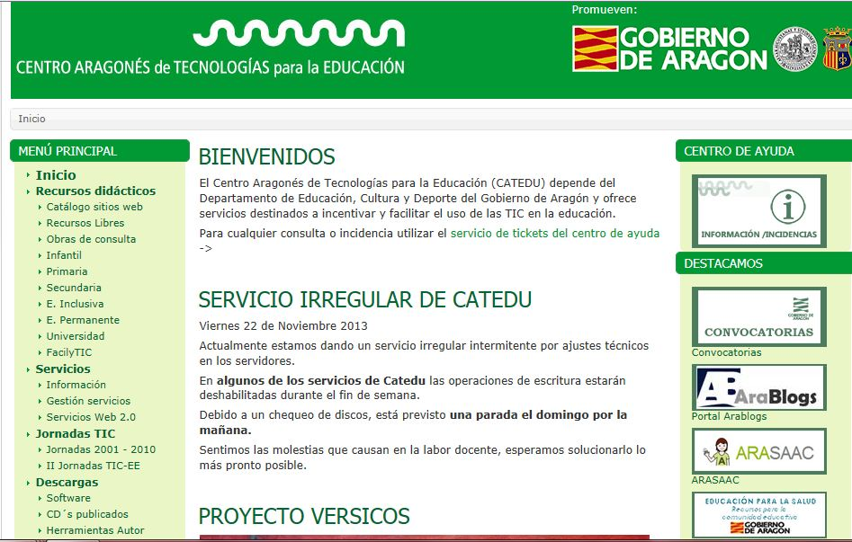

# 1.2. PORTAL DEL CATEDU

El **Centro Aragonés de Tecnologías para la Educación** ([CATEDU](http://www.catedu.es/webcatedu/)) tiene su centro en Alcorisa (Teruel). Su misión principal es investigar, desarrollar y difundir los recursos tecnológicos y de comunicaciones que aporten beneficios para cualquier nivel del ámbito educativo aragonés. Para ello, realiza trabajos de investigación, experimentación, desarrollo, evaluación, publicación y difusión de productos y servicios cuyo destinatario último será el Sistema Educativo Aragonés en toda su amplitud, sin perjuicio de que, al mimo tiempo, se favorezca su difusión en otros entornos educativos.

Como vemos, el portal se encuentra dividido en 3 columnas. A la izquierda encontramos un ámplio menú sobre el que volveremos más adelante, en la central están los artículos de los temas e informaciones más importantes en ese momento y a la derecha encontramos enlaces a algunos de los portales y servicios más interesantes del CATEDU.

Este portal es un sitio muy dinámico, de modo, que es posible que algunas de las descripciones o explicaciones que recogemos en este curso hayan variado y no se encuentren exactamente donde indicamos aquí. En cualquier caso, la forma de conocer y manejarse en cualquier portal educativo es navegando por él e investigando todos los recursos y opciones que pone a nuestro alcance, así que animate a probar, seguro que descubres cosas muy interesantes.

