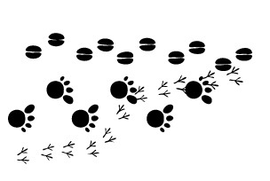

# 1.2. TIPOS DE BUSCADORES

Los buscadores se pueden clasificar en **tres tipos**, según la **forma de obtener las direcciones** que almacenan en su base de datos. Cada tipo de buscador tiene sus propias características. Conocerlas puede ayudarnos a decidir cuál utilizar en función de las necesidades de nuestra búsqueda. No obstante, hoy en día todos los buscadores tienden a ofrecer el mayor número de servicios posible, con lo que sus ofertas de búsqueda se asemejan cada vez más, siendo difícil adivinar de qué tipo de buscador estamos hablando.

Fig 4.2. Huellas. Autor: Anonymous. http://openclipart.org/detail/34681/architetto----tante-orma-sulla-neve-by-anonymous. OpenClipArt.

