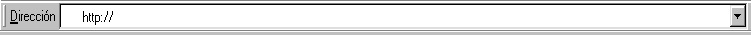

# 1.3. ACCESO A UNA PÁGINA POR SU DIRECCIÓN

En múltiples ocasiones, llega hasta nosotros la dirección de un página web que puede ser de nuestro interés. ¿Qué debemos hacer para que nuestro navegador nos la muestre? Es simple: basta con escribirla dentro de la barra de direcciones. Ésta suele estar colocada en la parte alta de la ventana del navegador, y tiene el siguiente aspecto:

Fig 2.5. Barra de direcciones. Captura de pantalla.

Para acceder a una página mediante la **barra de direcciones** sólo tenemos que seguir los siguientes pasos:

1. Introducir el cursor dentro del espacio blanco de la barra con un "clic" de ratón.

2. Escribir cuidadosamente la dirección. Hay que tener en cuenta que las direcciones de páginas web nunca llevan espacios en blanco, y raramente mayúsculas. Es importante escribir exactamente la dirección, ya que cualquier pequeño error provocará que el navegador no encuentre la página solicitada.

3. Pulsar la tecla Intro del teclado.

## Actividad

Pulsa en la siguiente dirección y, moviéndote por los vínculos y menús que ofrece la página, intenta localizar la página en la que aparece el calendario escolar para este curso académico.

[www.educaragon.org](http://www.educaragon.org/)

