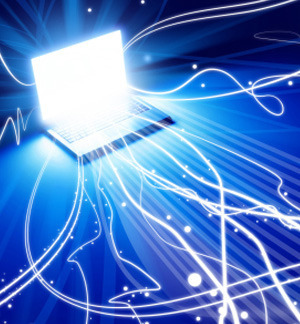

# 1.3. ¿QUÉ NECESITAMOS PARA CONECTARNOS A INTERNET?

Para conectarse a Internet se necesitan varios elementos. Hay que tener en cuenta que dependiendo del tipo de conexión que elijamos, los elementos que necesitamos serán distintos.

En general, necesitaremos un ordenador, una conexión, modem/router, y un proveedor de acceso a Internet.

