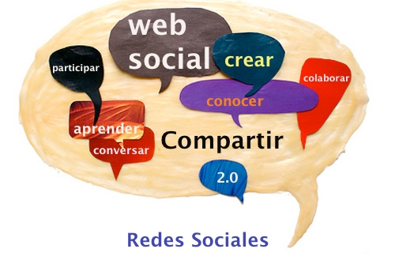
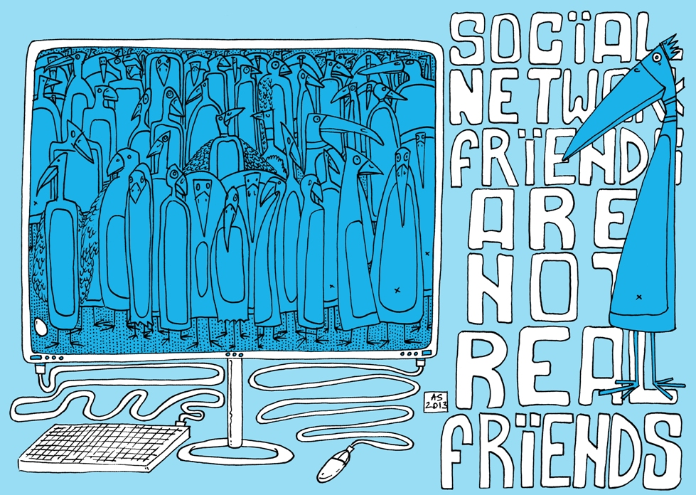

# 1.3. VENTAJAS E INCONVENIENTES

 

Como hemos visto, las redes sociales han generado un cambio importante en distintos ámbitos de la sociedad actual, por tanto, debemos detenernos a analizar en qué aspectos nos benefician dichos cambios y qué riesgos nos pueden presentar.

 

**VENTAJAS:**

- Poder reencontrarnos y** facilitar el contacto** con personas conocidas, eliminando las distancias espaciales.
- **Romper el aislamiento**. Ofrecen anonimato y la comunicación es más libre.
- Propiciar** nuevos contactos** de distinto tipo: amistad, profesionales, según intereses comunes, afectivos,...
- Todos los usuarios están al mismo nivel, lo que **fomenta la integración** y el sentido de pertenencia.
- Disponer de **información actualizada** sobre temas de interés: noticias, eventos, actos,...
- **Incrustar** todo tipo de **contenidos**.
- **Movilizar** rápidamente a grupos numerosos de personas ante un hecho específico.
- Facilitar las relaciones comerciales y la publicidad.
- Favorecer la** educación** formal e informal.

 

 

**INCONVENIENTES:**

- **Adicción**: se estima que entre los usuarios de Internet hay un 6% de adictos. Consumen una gran cantidad de tiempo y el exceso de información produce sobrecarga (infoxicación), disficultando la discriminación de contenidos y el equilibrio en el tiempo utilizado.
- **Aislamiento social** al sustituir los contactos virtuales por los reales.
- **Falta de privacidad**. Según la Agencia Española de Protección de Datos, el 43% de los usuarios tienen sus perfiles configurados de forma que el acceso al mismo es abierto, ésto, junto al exceso de información personal que aportan los datos que se publican, hacen que la privacidad pueda verse en peligro. Esto es especialmente preocupante en el caso de los menores.
- **Falta en el control de datos**. Por ejemplo: en muchas ocasiones, lo que publicamos en la red, pasa a ser propiedad de la red social. Pueden apropiarse de lo que publicamos e incluso de nuestra identidad en la red.
- **Suplantación de personalidad** (ejem.: grooming)

## Ventajas e inconvenientes

Ventajas e inconvenientes de las redes sociales: [https://www.youtube.com/watch?v=dURMc2QzO3I](https://www.youtube.com/watch?v=dURMc2QzO3I)

Canal de Youtube del programa "PANTALLAS AMIGAS" con información, vídeos y consejos sobre internet y las redes sociales, sobre todo en el caso de menores: [https://www.youtube.com/user/pantallasamigas](https://www.youtube.com/user/pantallasamigas)

