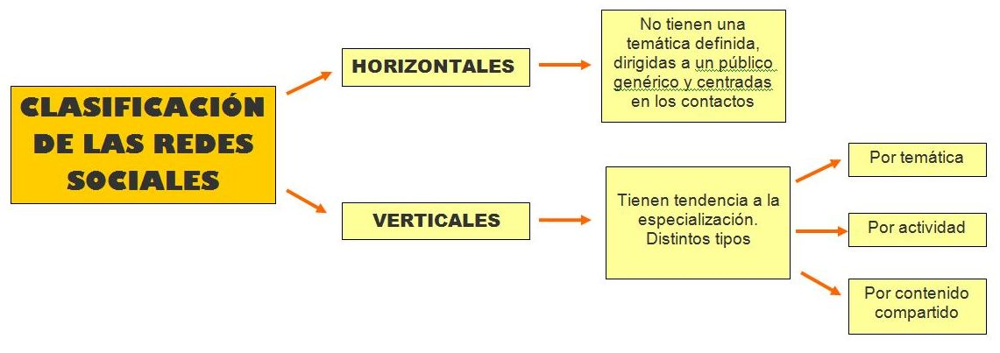

# 1.4. TIPOS DE REDES SOCIALES

 

https//www.youtube.com/watch?v=gRKctZjfRLk

 

Como hemos visto, la variedad de redes sociales en Internet es enorme y, en general, tienen características, objetivos y usos muy diferentes entre si, de modo que podemos establecer  la siguiente clasificación:

 

 Para comprender mejor esta clasificación, en la siguiente página, podemos ver las distintas tipologías ejemplificadas con las redes sociales más conocidas.

[http://recursostic.educacion.es/observatorio/web/es/internet/web-20/1043-redes-sociales?start=3](http://recursostic.educacion.es/observatorio/web/es/internet/web-20/1043-redes-sociales?start=3)

Fig. 7.5. Clasificación RR.SS. Captura de pantalla.

 

