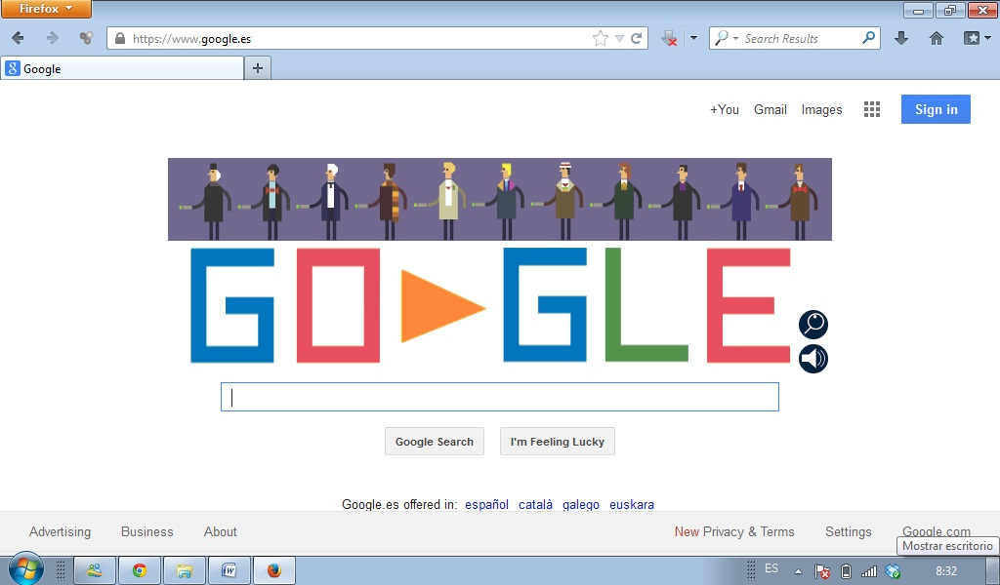

# 2.1. POSIBILIDADES GENERALES DE GOOGLE

La página principal de este buscador es extremadamente sencilla y clara. Su aspecto es el siguiente:

 

 4.7. Google. Captura de pantalla.

 

Podemos consultar en la ayuda del buscador google si tenemos alguna duda sobre su uso: [https://support.google.com/websearch/?source=g&amp;hl=es#topic=3378866](https://support.google.com/websearch/?source=g&amp;hl=es#topic=3378866) 

