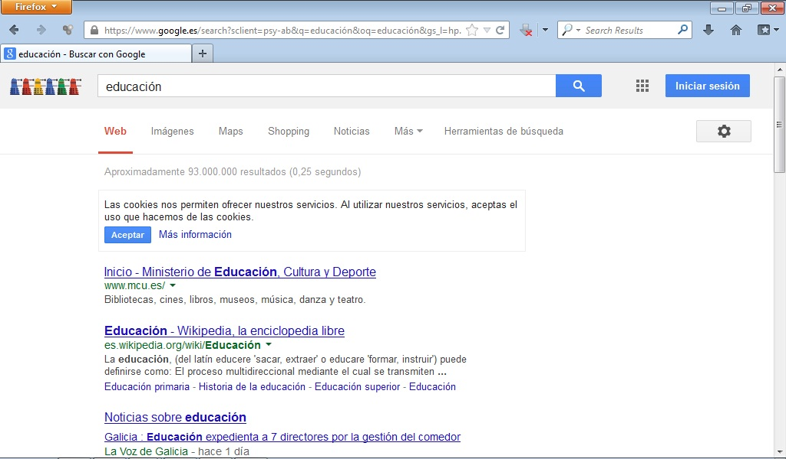
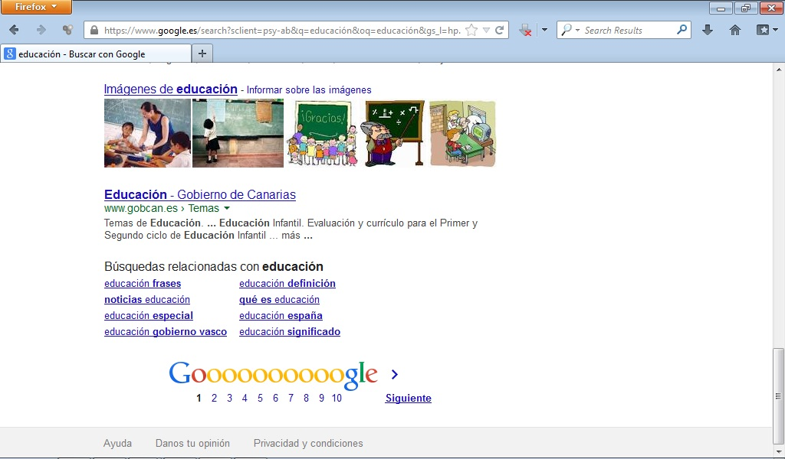
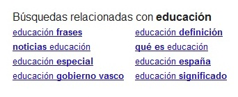
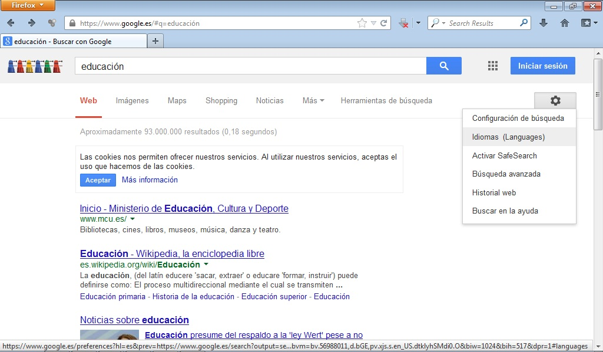
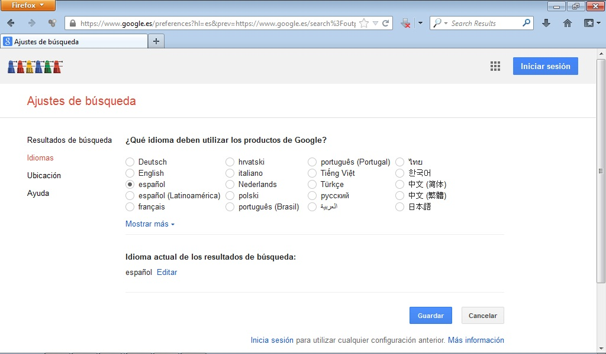

# 2.2. BÚSQUEDA DE PÁGINAS

Es la que nos va a proporcionar resultados más numerosos, siempre que el objeto de la búsqueda sea concreto. Para realizar este tipo de búsqueda de forma elemental se deben seguir **los siguientes pasos**:

 

 Fig 4.8. Búsqueda. Captura de pantalla. 

1.- **Introducir las palabras relacionadas con el tema deseado** en el espacio en blanco colocado a tal efecto en la parte central de la ventana. En este caso, hemos puesto educación.

2.- **Pinchar** en la **lupa**.

3.- Si pinchamos en **Herramientas de búsqueda **se nos ofrecen las siguientes posibilidades: buscar por país, idioma, fecha o todos los resultados.

 4.9. Herramientas de búsqueda. Captura de pantalla.

 

Observamos que se muestran gran variedad de páginas relacionadas con la palabra que acabamos de buscar. Si **bajamos hacia abajo, **justo al final de la página, podemos ver que hay **varías páginas** podemos pinchar en ellas para observar todos los **resultados de la búsqueda**.

 

 4.10. Búsqueda 2. Captura de pantalla.

 

Podemos observar que se nos muestran otras posibilidades para buscar sobre el tema elegido "Búsquedas relacionadas con educación". Si pinchamos en las diferentes posibilidades se nos mostrarán otras páginas web relacionadas con el tema.

 4.11. Búsqueda 3. Captura de pantalla.

 

## Importante

Si el buscador no está en el idioma deseado puedes cambiarlo. Para ello, debes pinchar en el siguiente icono y seleccionar idioma.

 4.12. Idioma. Captura de pantalla.

 

Tras pinchar en idioma se nos abre la siguiente pantalla.

 

 4.13. Idioma 2. Captura de pantalla.

 

Seleccionamos el idioma deseado y pinchamos en guardar.

