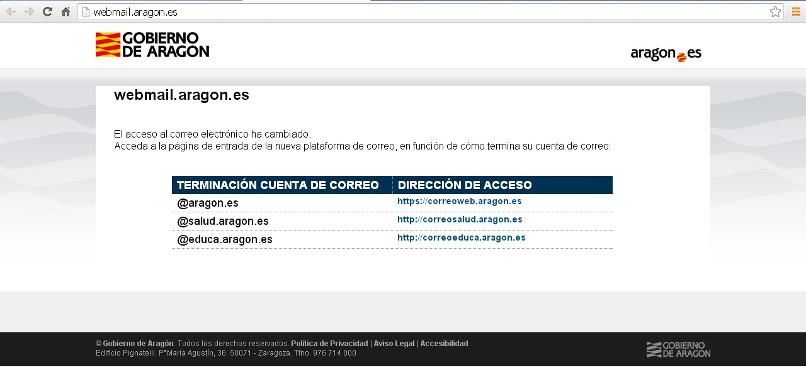
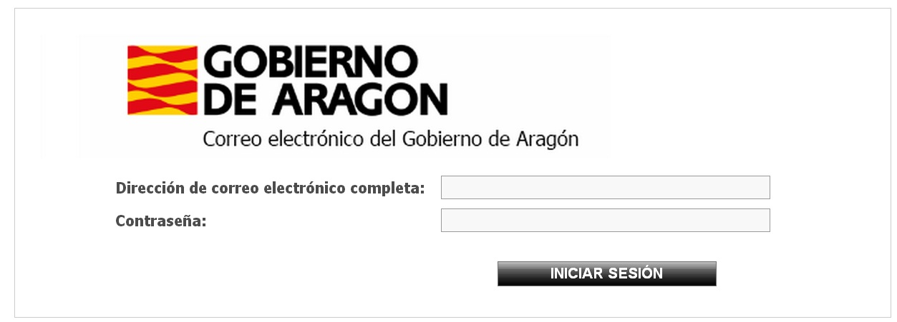
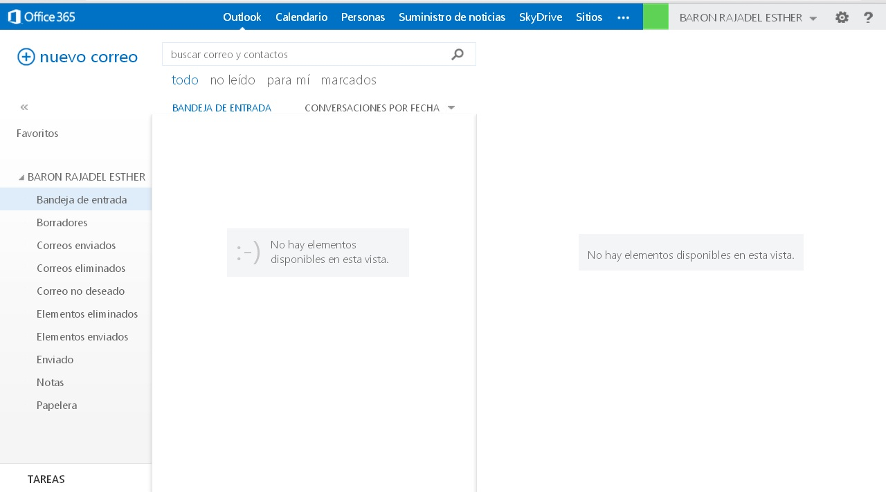

# 2.2. GESTIÓN DEL CORREO DE EDUCA.ARAGON.ES

En primer lugar para solicitar la cuenta de educa.aragon.es deberás consultar la siguiente página.

[http://www.educaragon.org/GestionPersonal/nodo.asp?id=2153](http://www.educaragon.org/GestionPersonal/nodo.asp?id=2153)

Una vez que tengamos la cuenta de correo ya podemos empezar a trabajar en esta parte de la unidad.

Antes de empezar es necesario que tengas claro algunas cosas: para configurar esta cuenta de correo, debes saber que el POP y el SMTP en este caso son mail.educa.aragon.es; esta cuenta de correo hay que solicitarla al Portal del Empleado del Gobierno de Aragón.

Para utilizar el correo de educa.aragon.es hay que entrar en  <a>http://correoeduca.aragon.es</a>

 

 1.8. Webmail Aragón. Captura de pantalla.

 

Pincharemos en la opción que corresponda a la terminación de nuestra cuenta de correo electrónico.

 

 1.9. Iniciar sesión. Captura de pantalla.

En la primera línea, **Correo electrónico**, deberemos poner la dirección de correo electrónico completa, así si nuestra dirección es nombre@educa.aragon.es, pues deberemos poner todo; en la siguiente línea pondremos nuestra contraseña.

Pulsamos en "Iniciar sesión" y nos aparecerá esta pantalla:

 

 1.10. Nuevo correo. Captura de pantalla.

 

Como podemos comprobar hemos entrado en la **Bandeja**** de entrada**, donde podremos ver el correo que hemos recibido. Como podemos ver existen varios menús así que vamos a ir visitando los más importantes.  Las operaciones más importantes que podemos llevar a cabo desde la Bandeja de Entrada son las siguientes: enviar correos, leer correos e utilizar categorías y direcciones.

