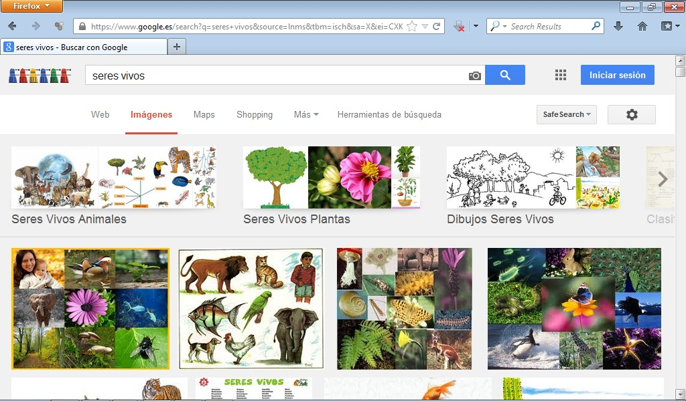
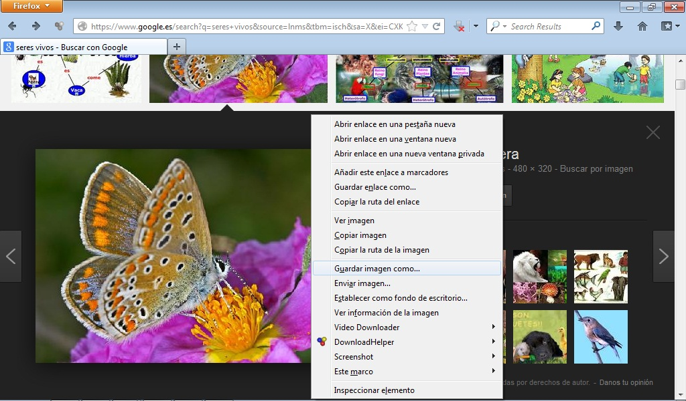

# 2.3. BÚSQUEDA DE IMÁGENES

Esta es una opción que nos brinda Google que resulta extremadamente útil. A partir de una **palabra clave** que nosotros introducimos nos proporciona un **conjunto de imágenes relacionadas** con esas palabras y que están contenidas en páginas web de su base de datos.

Para acceder a esta opción debemos pinchar sobre la pestaña Imágenes de la página principal de Google. Supongamos que utilizamos esta opción para hacer una búsqueda de imágenes sobre seres vivos. Escribimos seres vivos y pinchamos en la lupa.

Fig 4.14. Imágenes. Captura de pantalla.

 

Como resultado de la búsqueda se nos devuelve una **colección de imágenes**, en modo de vista previa, cuyo número dependerá de lo acotada que hayamos realizado la búsqueda. 

Si ponemos el puntero del ratón sobre la imagen aparece el tamaño de la misma y el nombre de la página web que la alberga.

Fig 4.15. Imagen. Captura de pantalla.

 

En esta vista previa decidiremos cuál es la imagen que nos interesa. Cuando hayamos elegido la imagen que queremos pincharemos sobre ella para verla en tamaño completo.

Una vez en tamaño completo si hacemos un clic sobre ella con el botón derecho del ratón nos aparece la siguiente pantalla:

Fig 4.16. Imagen 2. Captura de pantalla.

Desde aquí tenemos la posibilidad de copiar la imagen o guardar la imagen en nuestro ordenador.

 

## Importante

Cuando vayamos a descargar y utilizar imágenes u otros archivos de la web tenemos que tener en cuenta la normativa sobre la propiedad intelectual y derechos de autor.

Visualiza el siguiente documento: 

[http://issuu.com/rosagarzat/docs/navegar_y_buscar_en_internet._gesti_n_de_archivos./1?e=0/1234498](http://issuu.com/rosagarzat/docs/navegar_y_buscar_en_internet._gesti_n_de_archivos./1?e=0/1234498)

