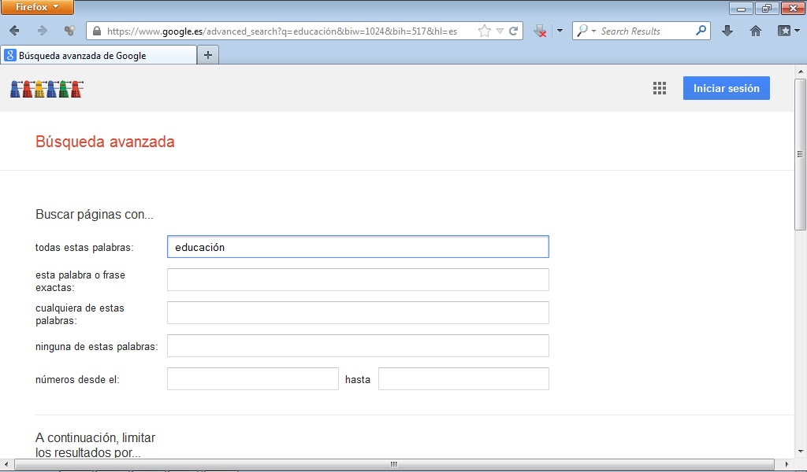

# 2.4. PERSONALIZACIÓN DEL BUSCADOR Y BÚSQUEDAS AVANZADAS

Cuando realizamos una búsqueda simple con Google, este localiza automáticamente páginas que contengan todas las palabras clave introducidas en la caja. Por ello, la forma de acotar la búsqueda, es decir, de reducir el número de páginas obtenido, es añadir más **palabras clave**. Si deseamos que encuentre páginas que lleven alguna de las palabras clave, o una expresión exacta (es decir, con las palabras en el orden que nosotros ponemos e incluyendo artículos, determinantes, etc...) debemos recurrir a la opción **Búsqueda avanzada.**

 

 

 

Si seleccionamos búsqueda avanzada obtenemos la siguiente pantalla de búsqueda.

 

 

 

Utilizaremos la opción de búsqueda que nos resulte más apropiada: tipo de archivo, idioma, región, etc.

Una de las opciones de búsqueda que nos ofrece google y es muy interesante es la de **derechos de uso**. Nos ofrece la posibilidad de filtrar los archivos en función de las siguientes opciones.

 

 

 

