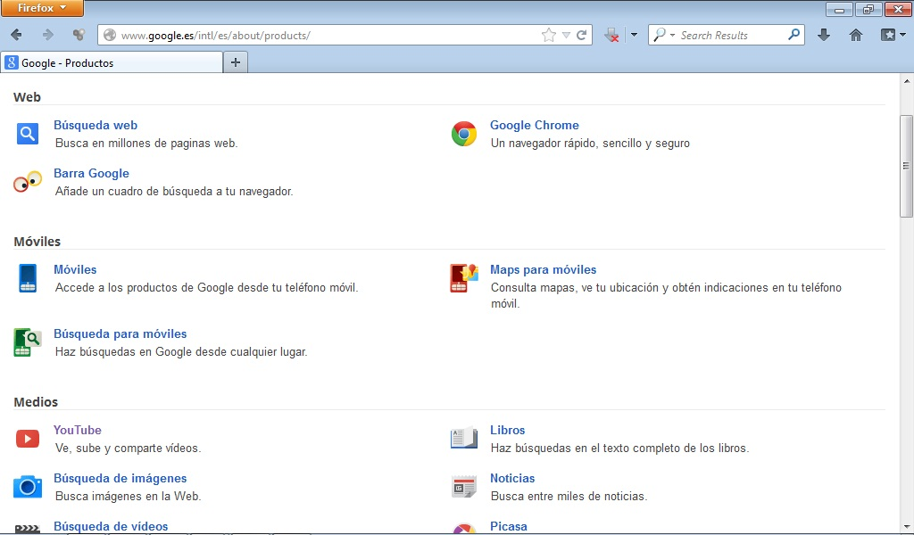

# 2.6. OTROS PRODUCTOS Y UTILIDADES

Como habrás podido comprobar a lo largo de la unidad, los ámbitos de búsqueda de **google** son muy diversos, pues bien, para completar este pequeño repaso solo nos queda dar una vuelta por aquellos **productos y aplicaciones** que nos van a permitir realizar un gran número de cosas casi sin necesidad de utilizar otros programas más complicados; para el uso de algunos de ellos el único requisito es registrarse como usuario.

 

 Fig 4.20. Productos de Google. Captura de pantalla. 

