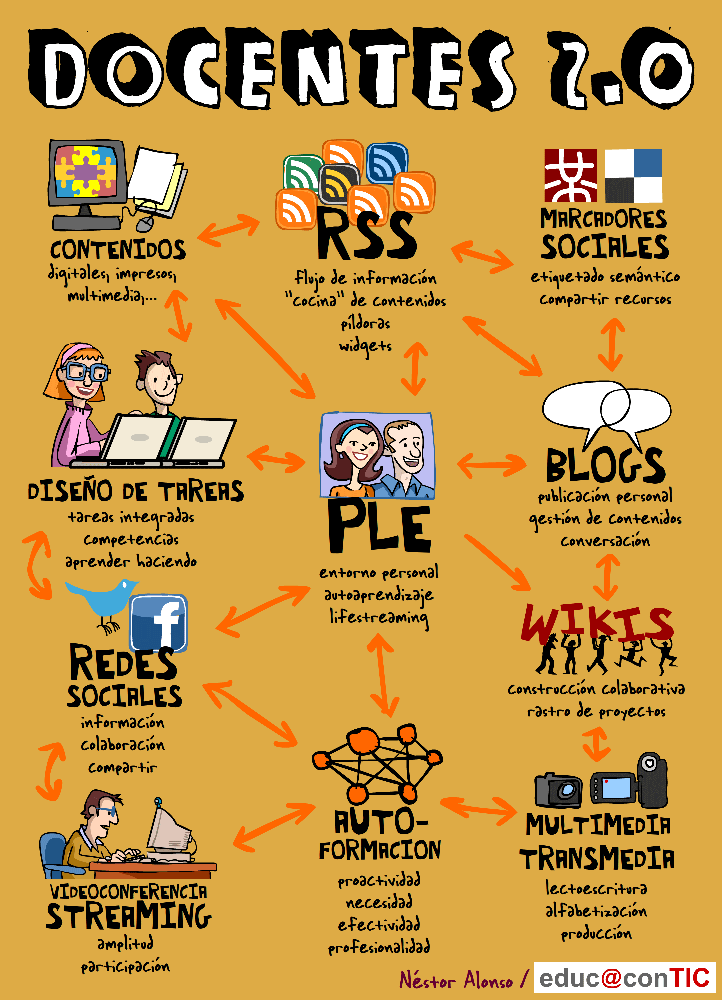

# 2.6. WEB 2.0

 

Fig. 1.39. Docente 2.0  Autor: Néstor Alonso. Fuente: [http://www.clasesdeperiodismo.com/wp-content/uploads/2011/07/docentes_2_0.png](http://www.clasesdeperiodismo.com/wp-content/uploads/2011/07/docentes_2_0.png)  Licencia Creative Commons.

 

Si bien Internet en sus inicios actuó como un medio para acceder y transmitir información y contenidos ya elaborados y para facilitarla comunicación entre usuarios de la red, desde hace unos años, Internet ha desarrollado un nuevo matiz que tiene que ver con exponer y **compartir contenidos abiertos, generados de una forma colaborativa, fomentando la aparición de comunidades virtuales que se asocian para trabajar o compartir un fin o intereses en común**. De hecho, se habla de las **4 C: comunicarse, compartir, colaborar y confiar**. Este cambio de enfoque afecta a diferentes aspectos de la red: la creación y desarrollo de software de forma colaborativa (usando códigos abiertos...), aparición de portales para compartir información, materiales, etc. sobre esas áreas o formatos concretos, desarrollo de comunidades virtuales y redes sociales, elaboraicón colaborativa y consensuada de contenidos, etc.

A este tipo de dinámicas y usos de Internet se les llama **Web 2.0** y en este momento hay muchos y **muy diferentes portales, programas y recursos** que forman parte de ella: aplicaciones web, redes sociales, wikis, blogs, alojamiento de vídeos, almacenamiento...

La Web 2.0 tiene, por sus características, una especial importancia en el campo de la formación, por sus **claras aplicaciones educativas**, motivo por el que se le dedicará más adelante un módulo del curso, a persar de lo cual, vamos a perfilar algunas delas más imporantes para empezar a intuir las posibilidades que nos pueden ofrecer en el ámbito educativo.

