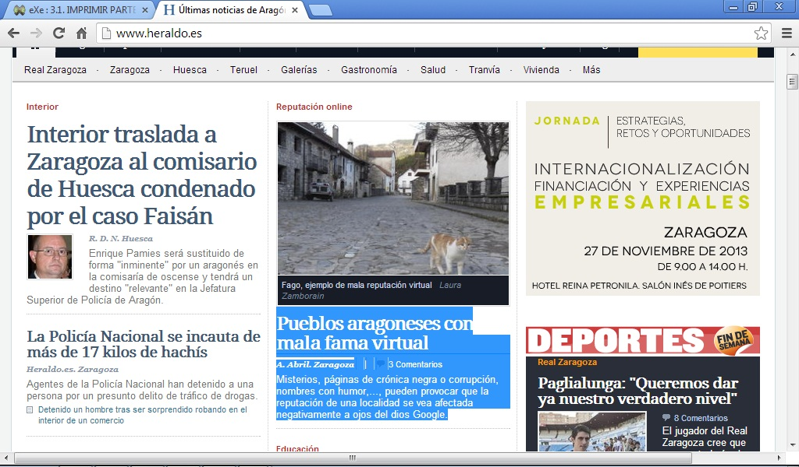
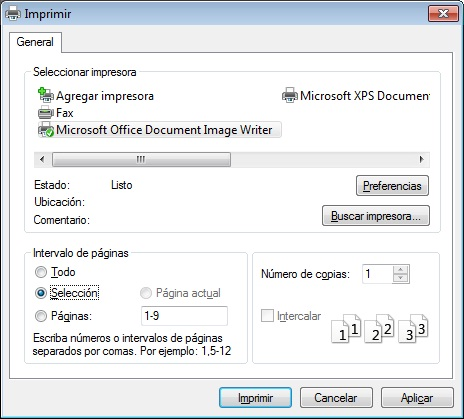

# 3.1. IMPRIMIR PARTE DE UNA PÁGINA

Cuando visitamos una página web no sólo tenemos acceso a ver la información que en ella se presenta. Podemos «capturar» el contenido de la página y así aprovechar toda o parte de la información que contiene para uso personal.

A veces nos puede interesar imprimir sólo una determinada parte de la página web. Para seleccionar una determinada zona de la página se procede de manera análoga a como lo haríamos en un procesador de textos: seleccionar, con el botón izquierdo del ratón, la zona que queremos dentro de la página web (veremos que la zona seleccionada cambia de color). A continuación, picamos con **el botón derecho del ratón** sobre la selección** --&gt; Imprimir** y en la ventana de Imprimir elegimos Selección.

En la imagen inferior aparece la página web de **Heraldo de Aragón**. Hemos seleccionado con el ratón una determinada noticia (se puede apreciar que la zona seleccionada está en color azul). 

Soltamos el ratón, hacemos clic con el botón derecho del ratón y seguidamente Imprimir.

 

Fig 4.31. Heraldo de Aragón. Captura de pantalla.

En la ventana de **Imprimir**, en la zona de Intervalo de impresión, picamos la opción **Selección ** y finalmente pulsamos **Aceptar**. De esta forma saldrá impresa una hoja que solo contendrá la noticia que habíamos seleccionado.

Fig 4.32. Imprimir selección. Captura de pantalla.

