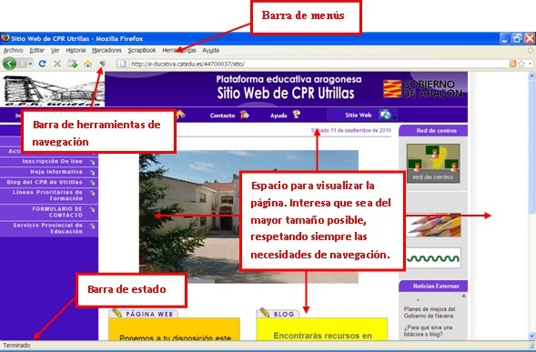

# 3.1. LA VENTANA DEL NAVEGADOR

En la unidad anterior ya has tenido ocasión de utilizar el navegador. No obstante, vamos a comentar brevemente el aspecto de la ventana que nos lo muestra. Ésta tiene varias partes:

 

 

