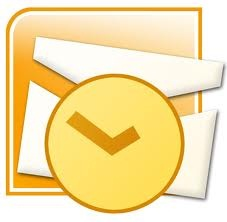
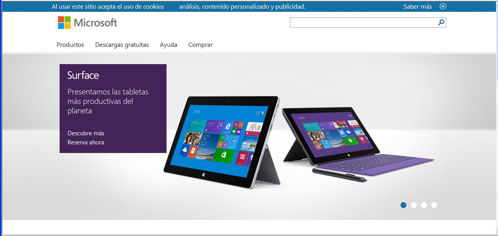

# 3.1. OUTLOOK EXPRESS

El programa Outlook-Express viene incorporado junto con el sistema operativo Windows y más concretamente con Internet Explorer, por eso seguramente lo tendrás ya instalado en tu ordenador. 

Una forma sencilla de comprobarlo es ir al escritorio de Windows y ver si tienes el icono el siguiente.

 1.27. Icono Outlook Express. 

También se puede ir al botón Inicio, seleccionar Todos los Programas y de la lista que resulta comprobar si está Microsoft Outlook Express o simplemente Outlook Express. 

Advertencia: No confundir Outlook Express con Microsoft Outlook (que es el cliente de correo que incorpora el paquete de programas OFFICE).

 1.28. Icono Microsoft Outllook. 

De todas formas a continuación se indica la dirección URL del sitio de Microsoft desde el cual podrás descargar, gratuitamente, el programa. Outlook Express viene integrado dentro del programa de Internet Explorer, por lo que el programa que debemos descargar es Internet Explorer (recomendamos la versión 5.5 o posteriores). 

Dirección URL del sitio de descarga: [http://www.microsoft.com/ms.htm](http://www.microsoft.com/ms.htm)

Una vez que entres en el sitio Web de Microsoft, basta con que busques la zona de descargas (Downloads) y elijas siempre el idioma Castellano (Spanish). También puedes hacer uso de la opción de búsqueda (Search) y escribir Internet Explorer. De esta manera te llevará directamente a la descarga de este programa.

1.29. Microsoft. Captura de pantalla.

 

Una vez que lo hayas descargado en tu disco duro, bastará hacer doble clic sobre el archivo y comenzará la instalación de Internet Explorer y sus herramientas (entre ellas el Outlook Express). Si sólo quieres que se instale el programa Outlook-Express, durante la instalación te dará la opción de Instalación Típica (recomendado) o realizar una Instalación Personalizada. Elige ésta última y de la lista de componentes a instalar selecciona sólo Outlook Express.  

El paso siguiente a la instalación de Outlook Express es la configuración de las cuentas de correo que vamos a utilizar.

Para ello pincha en el siguiente enlace donde se explica como configurar la cuenta:

**[Manual configuración cliente outlook express para cuentas de educación](COR_EDU_CONFIGURACIONOUTLOOKEXPRESS.PDF)**

Para consultar el manual de Outlook Express pincha en el siguiente enlace:

[Manual de Outlook Express](manual_de_outlook_express.pdf)

 

Visualiza el siguiente videotutorial donde se explica como configurar una cuenta con Outllook Express.

https//www.youtube.com/watch?v=sY4CSvdMecs

 

