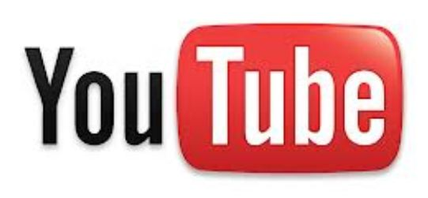

# 3.1. YOUTUBE

 Fig. 6.8. Logotipo Youtube. Captura de pantalla.

[Youtube](https://www.youtube.com/?gl=ES) apareció a principios de 2005 y fue adquirido por Google en octubre de 2006 por 1650 millones de dólares. Actualmente, **es el sitio web de alojamiento de vídeos más usado del mundo**. Sus **datos** son espectaculares:

- El 14 de febrero cumplirá 8 años online.
- El primer video en subirse se llamó “Me at the Zoo” (Yo en el zoológico).
- Los videos Full HD fueron lanzados oficialmente en noviembre de 2009.
- En mayo de 2010 rompió la barrera de las 2000 millones de visitas diarias.
- En diciembre de 2012 alcanzó las 4 millones de horas de video al mes.
- El primer video en alcanzar las 1000 millones de visualizaciones fue Gangnam Style.
- Es el segundo mayor motor de búsqueda después de Google, siendo más grande que Bing, Yahoo! y Ask combinados.
- Cada segundo se reproducen unos 46.296 videos de YouTube en todo el mundo.
- Tiene más de 800 millones de visitas al mes.

Vemos que la cantidad de vídeos alojados en Youtube es enorme, por eso, en ocasiones, cuesta encontrar algo adecuado a determinados fines educativos. Para facilitar esa tarea, Youtube ha creado el servicio  ["Youtube for Schools"](http://www.youtube.com/schools) en el que que permite el filtrado de los vídeos publicados en YouTube a través de una cuenta de correo creada por un profesor. También hay otros subdominios dentro de youtube relacionados con la educación como: **Youtube Teacher** y **Youtube Edu**, como se explica en el siguiente enlace:

[http://recursostic.educacion.es/observatorio/web/es/internet/recursos-online/1024-youtube-for-schools](http://recursostic.educacion.es/observatorio/web/es/internet/recursos-online/1024-youtube-for-schools)

 

Para utilizar Youtube es necesario registrarse o acceder con una cuenta de gmail.  Una vez dentro, es muy sencillo **subir un vídeo** a la plataforma, como se muestra en este[ manual](http://catedu.es/materialesaularagon2013/web20/MANUALES/youtube.pdf):

 

 Como recurso web 2.0, lo interesante de **Youtube no es sólo la opción de subir, buscar o compartir vídeos**, sino que nos permite **incrustarlos en nuestros blogs**, wikis o webs de clase o de centro, de la forma que hemos explicado en este módulo.

