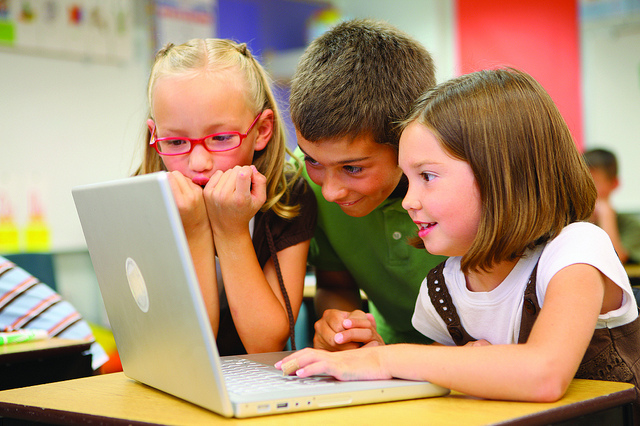

# 3.2. BLOGS DE AULA

- 5-22- Children at school- Autor: Lucéila Ribeiro- Fuente: http://www.flickr.com/photos/lupuca/8720604364/ CC

 

Son blogs que nos hablan de las cosas que suceden en clase (o en el centro) y en general,** se llevan a cabo con la participación de los alumnos**. Normalmente, si los alumnos son más pequeños su temática es má global, mientras que a medida que la edad de los alumnos aumenta, suelen ir especialízándose en un área o tema concreto.

Podemos encontrarlos en todas las etapas educativas y a través de ellos vemos las cosas que suceden en las aulas (desde el punto de vista del profesor y/o de los alumnos), se comparten las producciones de los alumnos, trabajan de forma colaborativa con otros, profundizan en un área o tema,... Veamos algunos ejemplos:

**Blogs en Ed. Infantil:**

* [La clase de Miren](http://laclasedemiren.blogspot.com.es/): Es un  blog de aula en el que la maestra va contando las cosas que suceden en clase.

* [Pequeños Alhameños](http://www.catedu.es/arablogs/blog.php?id_blog=152&amp;id_articulo=116340): Es un blog del CATEDU en el que los niños entran como usuarios de Ed. Infantil y pueden escribir sus propios artículos (después son transcritos por la maestra antes de su publicación). Se combinan los artículos escritos por los alumnos con otros publicados por los profesores.

**Blogs de Primaria:**

* [Escribir es importante](http://www.catedu.es/arablogs/blog.php?id_blog=2060&amp;id_categoria=13307): Blog elaborado con las producciones literarias de los alumnos del CEIP Gascón y Marín (Zaragoza).

* [Taller de prensa: ](http://www.catedu.es/arablogs/blog.php?id_blog=1994) En este blog de los alumnos de 5º del CP Tio Jorge de Zaragoza. Los post están redactados por ellos y cuentan a modo de noticias las cosas importantes que hacen o suceden en el colegio.

* [CEIP Valdespartera](http://www.catedu.es/arablogs/blog.php?id_blog=1600): Este blog está elaborado por los profesores del centro, bajo la coordinación de uno de ellos (Daniel Martín) y en él se explica lo que se va trabajando en cada aula, se muestran fotos, se suben trabajos,... Es además, una importante fuente de buenos recursos clasificados y organizados por etapas y áreas, juegos, aplicaciones, etc.

 **Blogs de Secundaria:**

 * [PROA IES Bajo Aragón](http://www.catedu.es/arablogs/blog.php?id_blog=2362&amp;pg=1) (Alcañiz): Blog en el que participan los alumnos del PROA escribiendo diferentes tipos de post en los que también incrustan presentaciones, vídeos,...

* [Lengua IES Joaquín Costa (Cariñena):  ](http://www.catedu.es/arablogs/blog.php?id_blog=2352)Blog aula para los alumnos de 4ª de la ESO en el que trabajan el área de lengua. Post con poesías, composiciones,... realizadas por ellos.

