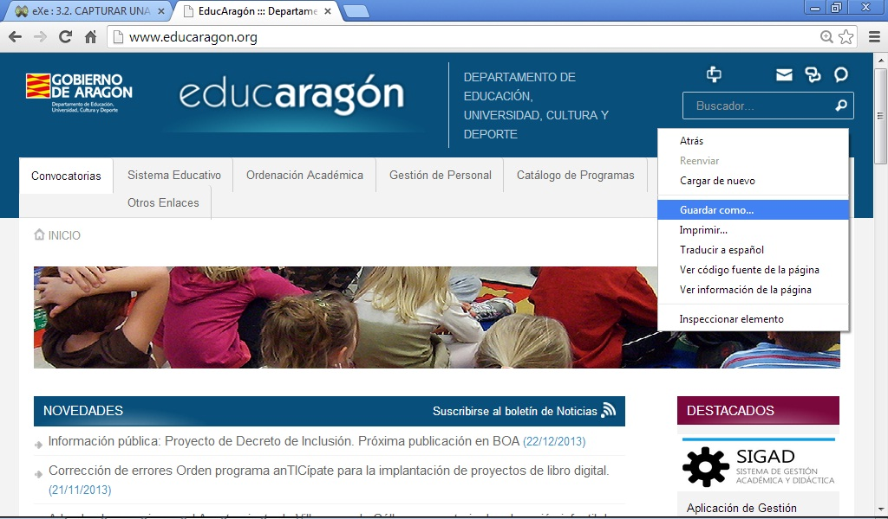
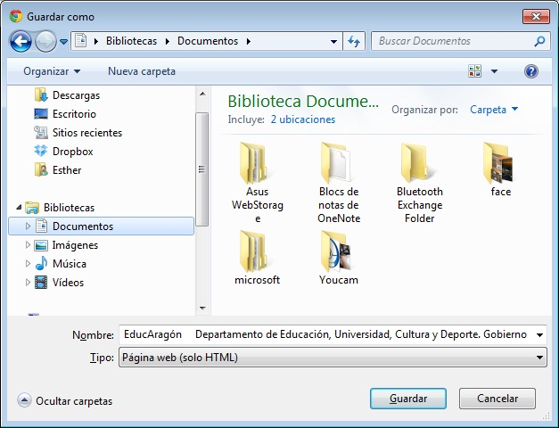
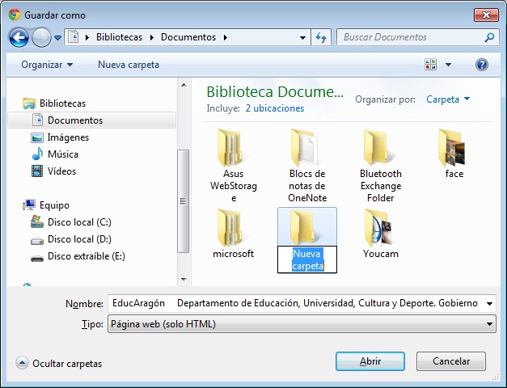
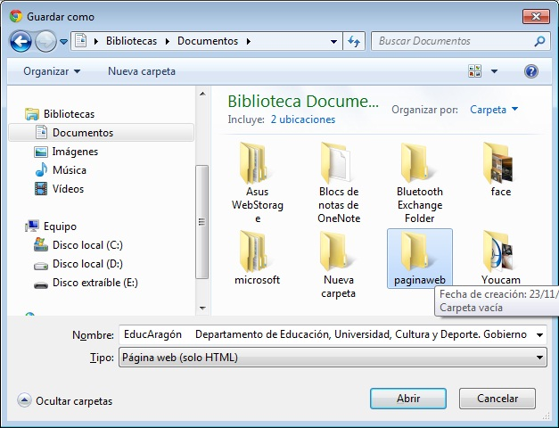
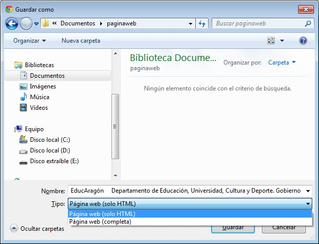

# 3.2. CAPTURAR UNA PÁGINA WEB EN ARCHIVO

Del mismo modo que se puede imprimir una página web, **podemos guardar**, en forma de fichero o archivo, todo el contenido de la misma. Veamos cuáles son los pasos a seguir:

1. Iniciamos el navegador y entramos en la página web que nos interese capturar: por ejemplo, vamos a la página de educación del Gobierno de Aragón ([http://www.educaragon.org](http://www.educaragon.org)).

Una vez se haya cargado toda la página, picamos con el botón derecho del ratón y seleccionamos Guardar como...

 

 Fig 4.33. Guardar. Captura de pantalla.

2. Entraremos en la ventana Guardar página web. Seleccionamos la carpeta del disco duro C: donde queremos guardar la página.

Habitualmente se suele guardar en una carpeta dentro de la carpeta **Documentos**. Lo primero que vamos a hacer es crear dicha carpeta que la llamaremos **Paginasweb**.

Para ello basta picar sobre el botón de crear nueva carpeta tal y como aparece en la imagen inferior.

 

Fig 4.34. Guardar como. Captura de pantalla.

 

     Aparecerá una nueva carpeta. Elimina el nombre **Nueva carpeta** y escribe el nombre **Paginasweb.**

 

Fig 4.35. Nueva carpeta. Captura de pantalla.

 

Vuelve a seleccionarla y a continuación pulsa el botón **Abrir**. De esta forma, nos situaremos dentro de esa nueva carpeta.

 

Fig 4.36. Carpeta página web. Captura de pantalla.

 

La zona donde se muestra el contenido de la carpeta. Evidentemente, como la acabamos de crear está vacía (no tiene ningún archivo).

En la línea Nombre de archivo aparece el nombre del archivo que contendrá nuestra página web. Ese nombre lo podemos cambiar si queremos.

 

Fig 4.37. Guardar página web. Captura de pantalla.

 

En la línea Guardar como archivos de tipo se nos pide que indiquemos cómo deseamos guardar nuestra página web. Por defecto se guarda como página web, completa (solo html). Si picamos sobre la flecha que está a su derecha (tal y como se muestra en la imagen de arriba), veremos el resto de las opciones de formato:

- Como una **página web, completa** (en cuyo caso el archivo llevará extensión** .htm o .html**): se utiliza para guardar todos los archivos necesarios para mostrar esta página, incluidos los gráficos, los marcos y las hojas de estilos. Esta opción guarda todos los archivos en su formato original.
- Como **página web, solo HTML** (la extensión será **.html o .htm**): se utiliza para guardar únicamente la página HTML actual. Esta opción guarda la información de la página web, pero no guarda los gráficos, sonidos ni otros archivos.

Una vez seleccionado el tipo de archivo, basta pulsar el botón Guardar.

Se recomienda guardar la página como **página web completa**, ya que de esta forma podrás ver el contenido de toda la página sin necesidad de estar conectado a Internet.

Por último, para abrir la página previamente guardada, fuera de conexión, lo haremos haciendo doble clic sobre el archivo de extensión .htm o .html que habrá dentro de la carpeta **Paginasweb**.

