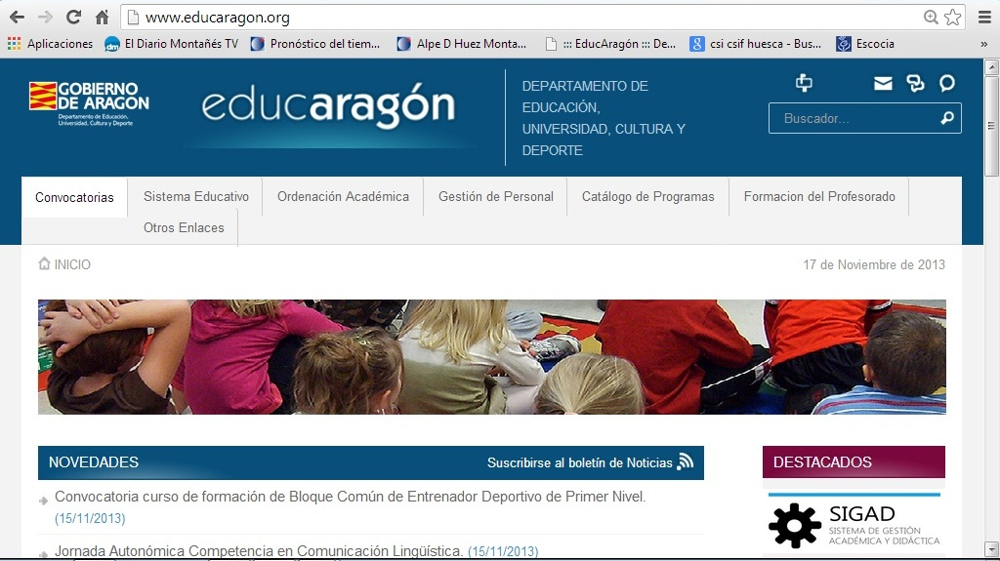

# 3.2. DETERMINACIÓN DE LA PÁGINA DE INICIO

Ahora que ya has navegado habrás observado que, al arrancar un navegador automáticamente nos muestra una página, cuya dirección aparece en la barra sin que nosotros la hayamos escrito.

Si el programa está recién instalado, y es la primera vez que se ha usado para ver páginas web, ésta **primera página** que se muestra es la página oficial del navegador y se le llama página de inicio. Como es lógico, esta primera página que se visualiza se puede cambiar. Veamos cómo hacerlo en cada uno de los navegadores con los que estamos trabajando.

 

