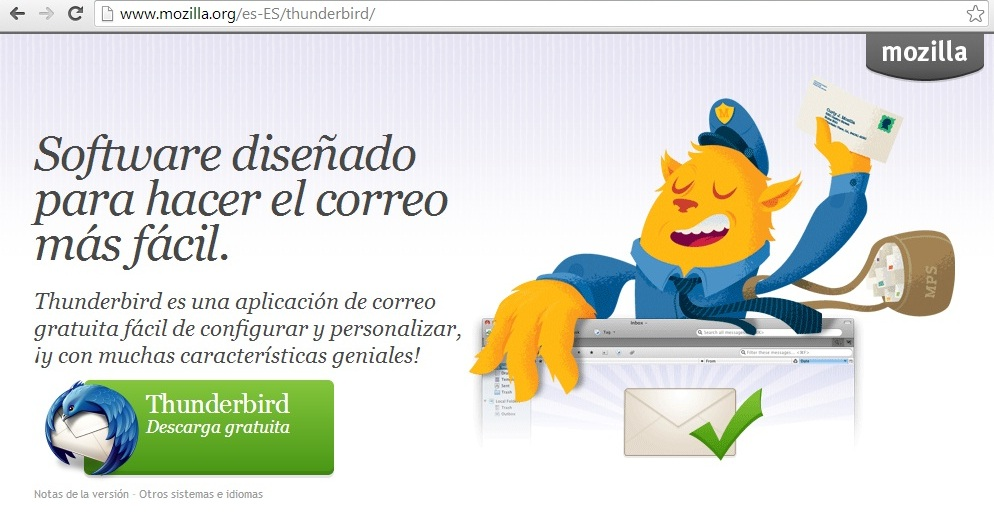
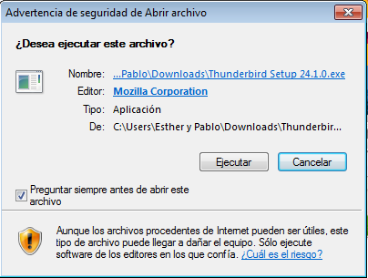
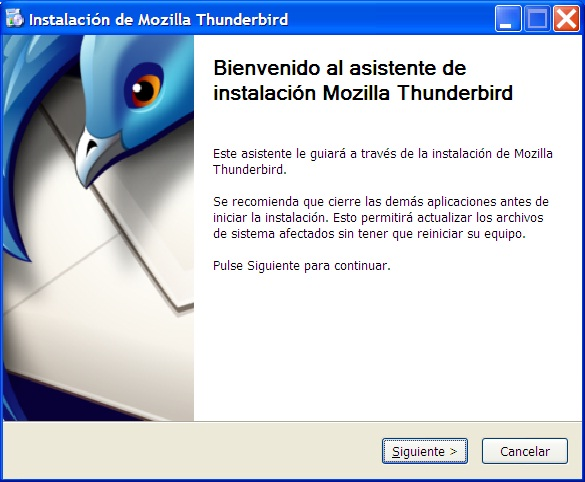
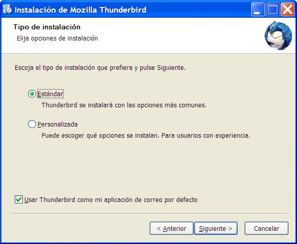
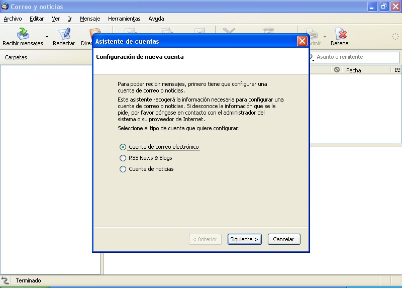

# 3.2. THUNDERBIRD

Thunderbird es un programa de correo gratuito y de código abierto. Para descargar este programa debemos entrar en la página oficial de Mozilla que es [http://www.mozilla.org](http://www.mozilla.org/). Al hacerlo nos saldrá la página siguiente.

 

 

En esta página seleccionamos la opción Thunderbird y pasaremos a esta otra página donde nos ofrecerá la opción de descarga gratuita.

 

 

 

 

Pinchamos en descarga gratuita. Una vez descargado, se nos inicia el asistente para la instalación del programa que comienza con la siguiente ventana.

 

Al darle a ejecutar nos aparece la siguiente ventana para comenzar el proceso de instalación.

 

Seleccionamos la opción Estandar y posteriormente instalamos el programa.

 

 

Una vez finalizado el proceso nos aparecerá la siguiente pantalla.

 

 

En la ventana emergente Asistente de cuentas nos aparece seleccionada por defecto la opción Cuenta de correo electrónico. La dejamos seleccionada y pulsamos en Siguiente apareciéndonos la ventana.

Seguiremos las instrucciones que hay a continuación para configurar la cuenta:

[**Manual configuración cliente Mozilla Thunderbird para cuentas de educación.**](https://ast.aragon.es/sites/default/files/correo-configuracion-thunderbird.pdf)

Para consultar el manual de Thunderbird pincha en el siguiente enlace:

[https://support.mozillamessaging.com/es/kb/all](https://support.mozillamessaging.com/es/kb/all)[  ](http://www.mozilla.org/es-ES/thunderbird/features/)

 

Visualiza el siguiente video tutorial donde se explica como configurar una cuenta de correo con Thunderbird.

https//www.youtube.com/watch?v=5rLefiJANR0

## Actividad

Descarga e instala en tu ordenador el programa Outllook-Express o Thunderbird. Luego configura tu cuenta de correo en uno de estos dos programas.

>**info**
>## Importante
>
>Si instalais cualquier programa en ordenadores con el Congelador instalado recordad que no podréis instalarlo en C: a no ser que los descongeléis.

