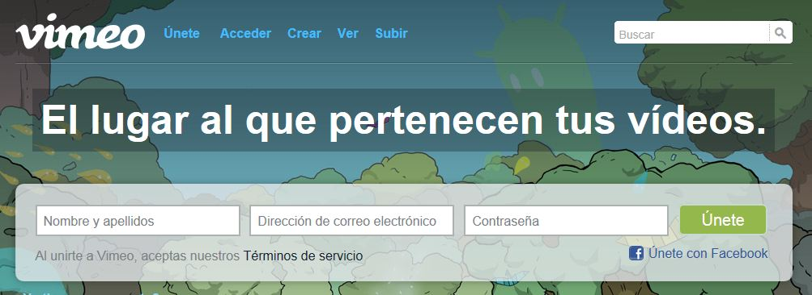

# 3.2. VIMEO

Fig. 6.9. Vimeo. Captura de pantalla.

[Vimeo](https://vimeo.com/) es otra plataforma de alojamiento de vídeos, pero presenta un aspecto más limpio que youtube porque no es tan popular ni está tan masificada. En Youtube la publicidad ha sido fundamental para su mantenimiento y expansión, mientras que Vimeo no admite vídeos comerciales, demostraciones de videojuegos, pornografía, o cualquier otro material que no haya sido creado por el usuario.

Vimeo también soporta vídeos en alta definición y permite a sus usuarios (de cuentas gratuitas) cargar hasta 500MB y un vídeo en HD a la semana.

Los vídeos en Vimeo también se pueden comentar, compartir, incrustar,... y si estás registrado puedes descargarlos.

 

https//www.youtube.com/watch?v=X8Yknr5QP2M

 

