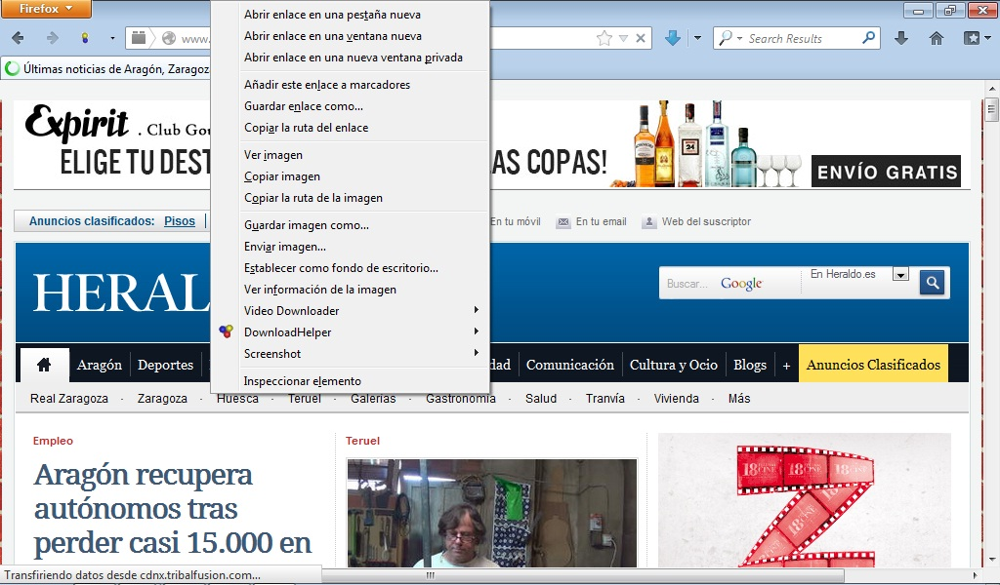
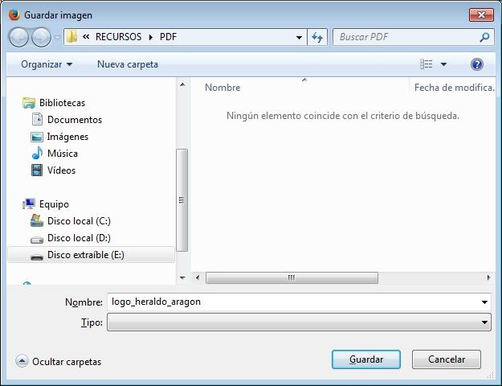

# 3.3. CAPTURA DE IMÁGENES

Las imágenes que podemos encontrar en la Web, tales como las fotografías y los dibujos, son digitales es decir, guardadas en forma de una secuencia de bits y que pueden ser modificadas en diferentes aspectos, como la medida y el color.

Las imágenes son almacenadas en archivos de gráficos, siendo los formatos más comunes en la Web los de extensión: **.jpg** y **.gif .**

Hay otros tipos de formato que corresponden a archivos de gráficos, tales como **.bmp**, **.tif**, **.pcx**, etc... 

Todos estos tipos de formato de gráficos responden a la tipología de formato de **Mapa de bits o Bitmaps**. Los bitmaps están compuestos por un **conjunto de bits** en la memoria del ordenador que definen el color y la intensidad de cada pixel de una imagen. Un **pixel** es cada una de las casillas o celdas en que se puede descomponer una imagen digital. Los bitmaps son típicamente usados para reproducir imágenes que contienen muchos detalles, sombras y colores: fotografías, negativos de películas y otras ilustraciones. Las herramientas usadas para crear bitmaps son los editores gráficos, que permiten pintar pixel a pixel con el color adecuado. Destacamos entre otros: Paint Shop Pro, Photoshop, Paintbrush, Corel Photopaint...

Como verás a continuación el proceso de la **captura de imágenes** **desde la Web** es tan simple como hacer **clic con el ratón**. Entramos en la página Web que queramos. Por ejemplo en la página principal del heraldo: **http://www.heraldo.es**. Elegimos una imagen (cualquiera de las fotografías) y nos situamos sobre ella con el ratón. Hacemos clic con el **botón derecho** del mismo y entraremos en un menú desplegable con varias opciones, algunas de las cuales están desactivadas. A continuación se describen algunas de las opciones más interesantes.

 

 

 

**Guardar imagen como...** es la opción que se utiliza para capturar una imagen. De esta forma se guarda la imagen como un archivo de gráficos en nuestro ordenador o un disco externo.

**Establecer como fondo de escritorio **nos permite colocar la imagen como fondo en nuestro escritorio.

**Copiar** **imagen** almacena temporalmente en el portafolios esta imagen para luego pegarla sobre cualquier documento de texto que tengamos abierto (opción Pegar)

**Ver información de la imagen **nos permite ver la propiedades del archivo imagen que tenemos seleccionado. Esta opción es interesante porque nos dice el tipo de formato que tiene el archivo.

Para capturar la imagen, basta con seleccionar la opción **Guardar imagen como...** A continuación se abrirá la ventana **Guardar imagen** desde la cual elegimos el lugar dónde queremos guardar el archivo, así como el nombre del archivo y la extensión o tipo de formato. Por último pulsamos el botón **Guardar.**

