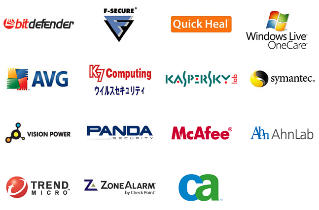

# 3.3. PROGRAMAS PARA RASTREAR Y PROTEGER TU PC

- 1-49- Antivirus- Imagen: antivirus-partners Autor: Thomas Guest Fuente: http://www-flickr-com/photos/thomasguest/3027199004/ Creative Commons-

 

Existen muchos programas para proteger nuestros ordenadores de las amenazas del malware. **Los antivirus más conocidos** son : McAfee, Norton, PAnda, Karpesky,... Son **de pago**, aunque todos ellos tienen una versiónde prueba gratuita, que funciona durante un tiempo limitado (y generalmente breve). Algunos, ofrecen también una versión en "la nube" que proporciona una buena protección pero está activa en tu ordenador sólo cuando estás conectado a internet.

Sin embargo hay algunos antivirus, que además de su versión de pago, tienen otra **gratuita que ofrece una protección buena y duradera para nuestros equipos.**

A continuación os proponemos una tabla con varios recursos gratuitos para prevenir, detectar y eliminar el software malicioso:

 

 

 
<td valign="top" width="28%">**PROGRAMA / DESCARGA**</td><td valign="top" width="48%">**CARACTERÍSTICAS**</td><td valign="top" width="22%">**MANUAL**</td>

**CARACTERÍSTICAS**

PANDA CLOUD ANTIVIRUS &amp;FIREWALL

Video tutorial

 

Además de éstos, hay **programas específicos para spyware, troyanos, virus concretos** (por ejemplo: Polifix está diseñado para eliminar el virus de la policía) o **discos de rescate** que se usan para revisar el ordenador arrancando desde el modo seguro (por ejemplo: Kaspersky recue disck).

## Importante

El malware se propaga a través de la red, por eso, es importante tener protegido no sólo nuestro ordenador, sino todos nuestros dispositivos con capacidad para conectarse a Internet: tabletas, smartphones,... hay antivirus disponibles para todos ellos.

 

## Para Saber Más

En este vídeo comparan los anteriores antivirus gratuitos explicando sus puntos fuertes y débiles, en qué situaciones son más recomendables, cómo han evolucionado, cómo es su manejo,...

 

 

https//www.youtube.com/watch?v=Yv82WW7muU4

## Actividad

Como hemos comentado anteriormente, una de las formas más habituales de propagación del malware es a través de los dispositivos de memoria externos que empleamos en distintos equipos (memorias usb, discos duros externos, tarjetas de memoria, mp3,...). Entre los antivirus presentados en la tabla, se recomendaba el MxOne para proteger dichos dispositivos.

En esta práctica, debes descargarte el programa [MxOne](http://www.mxone.net/descargas.php) y siguiendo las instrucciones del [tutorial](http://esdiversidad.blogspot.com.es/2008/11/tutorial-para-instalar-mx-one-el.html), instalarlo en una memoria usb (elegir esta opción en el proceso de instalación).

**ATENCIÓN:** Siempre que te descargues e instales un programa, presta atención a las preguntas que te hacen y a cómo, durante el proceso de isntalación, intentan ofrecerte otros programas asociados (barras de navegación, publicidad,...): rechazalos (normalmente, desmarcando casillas).

