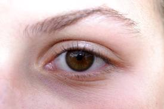

# 3.4. CÓMO MOSTRAR Y OCULTAR LAS BARRAS

A la hora de decidir qué **barras** queremos que nos muestre el **navegador**, debemos valorar dos aspectos contrapuestos. Por un lado, nos interesa que el espacio para visualizar la web sea lo mayor posible: si colocamos todas las barras que admite el navegador, lo reduciremos mucho. Por otro lado, las barras nos acercan funciones que, de no estar visibles, tendríamos que buscarlas entre los menús. La solución depende del uso que cada uno haga de estas barras. Si no se usan con frecuencia, merece la pena hacerlas desaparecer.Pero si se usan, se deben tener a la vista, aunque limiten la zona de visualización de la página. 

Vamos a conocer como **mostrar u ocultar las barras** en los tres navegadores que estamos estudiando.

 

Fig 2.22. Close up of eye. Autor: Lourie Pieterse. http://commons.wikimedia.org.  Creative Commons Attribution-Share Alike 3.0 Unported.

