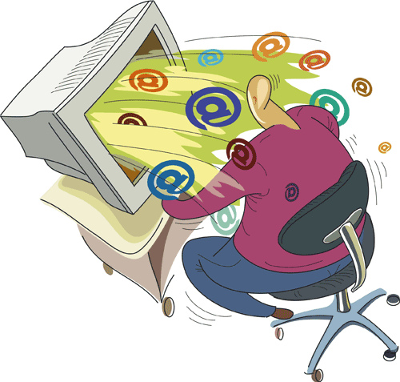

# 3.4. SPAM O CORREO BASURA

## Conocimiento previo

¿Qué es el spam o correo basura? ¿Cómo actúa en mi ordenador?

 

<iframe frameborder="0" height="275" src="//player.vimeo.com/video/27326941" style="margin-right: auto; margin-left: auto; display: block;" width="500"></iframe>

[ANTIVIRUS](http://vimeo.com/27326941) from [Rafikisland](http://vimeo.com/rafikisland) on [Vimeo](https://vimeo.com).

**El spam es el correo que recibimos en nuestro ordenador sin nosotros solicitarlo**. Para darnos cuenta del problema que supone el spam tenemos que tener en cuenta lo siguiente: más del 90% de los internautas ha recibido este tipo de correos alguna vez. El correo no deseado incluye numerosos tipos de mensajes desde los más perniciosos (fraudes, el phising del que tanto se oye hablar hoy en día, etc.), hasta los envíos publicitarios masivos (pornografía, medicamentos, 'gane dinero rápido', etc.) o los de los pequeños comercios que tratan de hacer un buzoneo barato.

El  problema puede no parecer serio para un particular, pero imaginémonos una gran empresa que recibe cientos de correos electrónicos al día, muchos de ellos correos basura. Pensemos en el tiempo que se pierde en borrarlos y, muy importante, pensemos en la posibilidad, grande, de borrar por equivocación correos que no sean basura y que sean realmente importantes para la empresa. Ahora pensemos en el coste económico que tiene todo esto para la empresa.

Una pregunta que surge de inmediato es ¿cómo han conseguido mi dirección de correo electrónico? Piensa que los correos que tú envías están en la red cuando son enviados y que estos correos dejan su huella: la fecha, el asunto, a quién va dirigido, el remitente, la dirección de correo. Una vez conocido esto te puedes imaginar que cualquiera con los suficientes conocimientos puede recoger esa información y utilizarla.

Una manera de** proteger tu ordenador** contra este tipo de correo basura es **utilizar los filtros, las listas negras y remitentes bloqueados que tienen la mayoría de los programas de correo** (Outlook, etc) y también el correo Web (en el módulo siguiente trataremos el correo electrónico en general y veremos estas opciones). También es importante seguir las normas que hemos dado respecto al correo electrónico al hablar de los virus.

