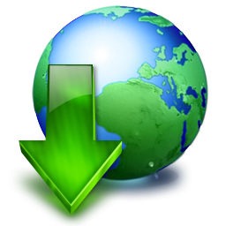

# 4.1. DESCARGAS DE SOFTWARE EDUCATIVO GRATUITO

Existen muchas páginas web desde las cuales nos podemos descargar programas educativos de carácter gratuito. Cuando lo hagamos debemos asegurarnos de su gratuidad y qué implica, porque podemos estar bajando programas con diferentes características:

- **Freeware o Gratuito:** Significa que el programa es gratuito y no se cobra nada por la descarga. Una vez descargado, lo podemos instalar en nuestro ordenador y manejarlo sin ninguna limitación.
- **Evaluación:** Este tipo de programas son de descarga gratuito pero dejan de funcionar cuando ha pasado un determinado número de días (generalmente 30). Es una buena opción para probar un programa antes de lanzarnos a comprarlo.
- **Demo:** Como deja entrever su nombre es una versión que está limitada a un determinado número de usos o a un determinado número de días. Generalmente, tampoco se puede probar todo el programa completo sino solo alguna de sus partes.

Uno de los portales de descarga más importantes es [Softonic](http://www.softonic.com/). Tiene un buscador de software (incluso si buscamos en Google un programa normalmente nos remite a este portal) y nos presenta una ficha de cada programa con la valoración que hacen del mismo los usuario y el equipo de softonic, las características, etc.

Para **realizar la descarga**, Softonic nos instala un programa de descarga y a partir de su ejecución comienza la descarga y después (si queremos) la** instalación** del programa descargado. Siempre durante estos pasos **debemos estar muy atentos** a las preguntas que nos va haciendo el asistente de instalación y analizar bien qué es lo que estamo aceptando en cada caso, pues en muchas ocasiones nos "invita" a instalarnos otros programas o barras de herramientas que no son de nuestro interés.

 Otra forma de descargar el software gratuito es **ir directamente a la página del creador** de dicho programa (en el fondo, esto es lo que hacen páginas como softonic, evitándonos esa búsqueda).

