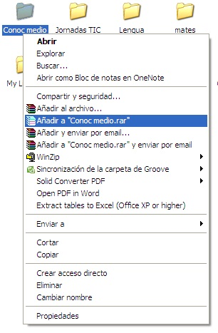
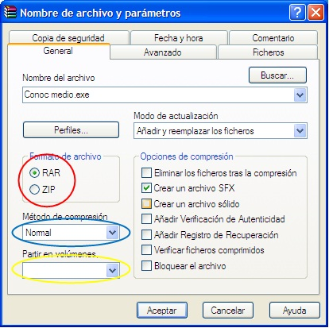
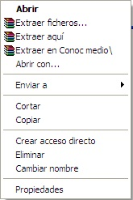
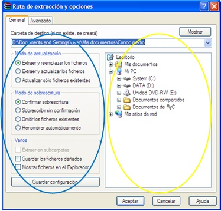

# 4.1. WINRAR

Winrar es un programa cuya función es comprimir y descomprimir carpetas y archivos **.rar**. Este programa suele ser de pago y del cual existen multitud de opciones, si bien en la red encontrarás versiones de evaluación que podrás descargar y utilizar durante un tiempo. Todas las versiones tienen un manejo muy parecido, además, las explicaciones te serán útiles para Winzip.

Este programa tiene multitud de opciones y posibilidades, sin embargo, de cara a la utilidad del curso vamos a explicar el manejo básico de este software basándome en el uso del botón derecho, pero debemos saber que hay el programa tiene muchas más opciones.

### Compresión

 

Para comprimir un archivo nos situamos sobre el archivo o la carpeta que queremos comprimir y hacemos **click derecho**, obteniendo el siguiente menú contextual.

 

Con la **opción  "Anadir a (nombre del archivo o carpeta que queremos comprimir).rar"**, creamos un archivo comprimido  con el **mismo nombre y localización **del archivo o la carpeta que queríamos comprimir.

 

 

 

Con la opición **"Añadir al archivo..." **nos sale el cuadro de diálogo que aparece más abajo**. **Nos permite crear un archivo comprimido con el **mismo nombre y la misma localización** del archivo o la carpeta que queremos comprimir, pero además, podremos:

 

- Determinar que el archivo comprimido sea **.zip o .rar **(círculo rojo).

- Determinar el tipo **(grado) de compresión **(elipse azul).

- **Fraccionar el archivo **en partes iguales de un tamaño que podemos fijar nosotros mismos (elipse amarilla). Es importante tener en cuenta que la **unidad** que se emplea es el **byte**. Si hemos usado esta función anteriormente winrar memoriza los tamaños que ya hemos usado, de manera que si queremos emplear una tamaño anterior no es necesario escribirlo, es suficiente con picar en el triángulo invertido que indica que es una **lista desplegable.**

- Crear un **archivo autoextraíble**, que puede a su vez estar **partido** o bien ser **un solo archivo**. Para ello hay que hacer clic en la casilla “Crear un archivo SFX” con le objeto de marcarla.  Si no hemos seleccionado ningún tamaño de archivo creará un ejecutable. Si determinamos el tamaño nos creará el ejecutable y varios archivos en función del tamaño que hayamos determinado. En la pestaña **"Avanzado" **podemos determinar el tipo de SFX picando en el botón **"Opciones SFX".**

- Establecer una **contraseña**. Para ello hacemos clic en la pestaña "Avanzado". Dentro de ella picamos sobre el botón "Establezca la contraseña".

 
### Descompresión

 

Winrar puede **descomprimir varios tipos de archivos**, además de los .rar, siendo el proceso el mismo en todos los casos.

 

Los archivos **.rar** se representan por el  siguiente icono.

 

Para descomprimir nos situamos sobre el icono del archivo que queramos descomprimir, hacemos **click derecho **y nos saldrá el siguiente menú contextual.

 1.41. Descomprimir. Captura de pantalla.

- Con la opción **"Extraer en (nombre del archivo que queremos descomprimir)" **descomprimiremos el archivo **en lugar en el que estamos **y winrar **creará una carpeta con le nombre del archivo** en cuyo interior se encontrará este descomprimido.

- Con la opción **"Extraer aquí" **descomprimiremos el archivo en el lugar en el que estamos, con el mismo nombre que el archivo que el documento .rar, pero sin incluir dentro de ninguna carpeta, es decir, **suelto.**

- Con la opción **"Extraer ficheros..." **podremos determinar:
	- El **lugar en el que queremos descomprimir **los archivos. Para ello nos iremos a la zona señalada por un círculo amarillo. **Si picamos en las cruces se desplegarán las subcarpetas contenidas**. Así iremos siguiendo la ruta adecuada hasta llegar a la carpeta en la que queramos guardar el archivo.
	- La **acción **que debe realizar el programa al descomprimir los archivos.

 

 

Para descargar WinRar pincha en: [http://www.winrar.es/descargas](http://www.winrar.es/descargas)

Puedes consultar el siguiente manual de WinRar: [http://www.winrar.es/soporte/manual](http://www.winrar.es/soporte/manual)

 

