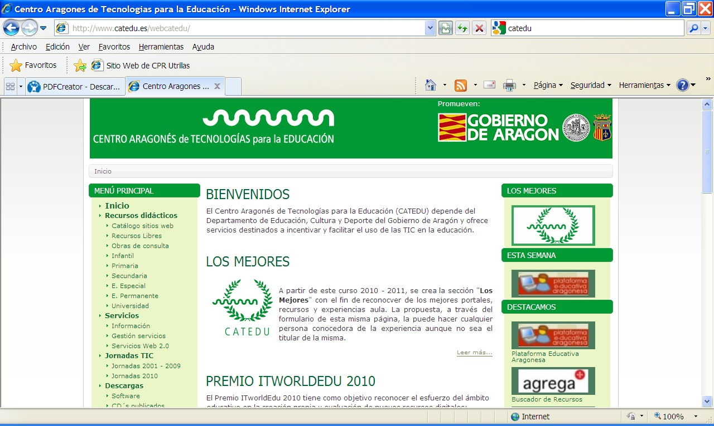
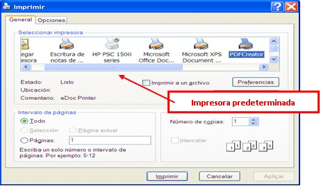
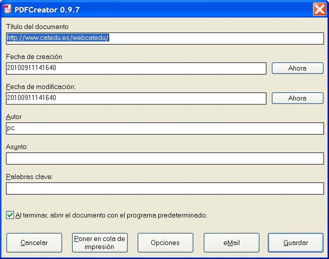
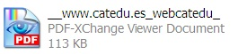
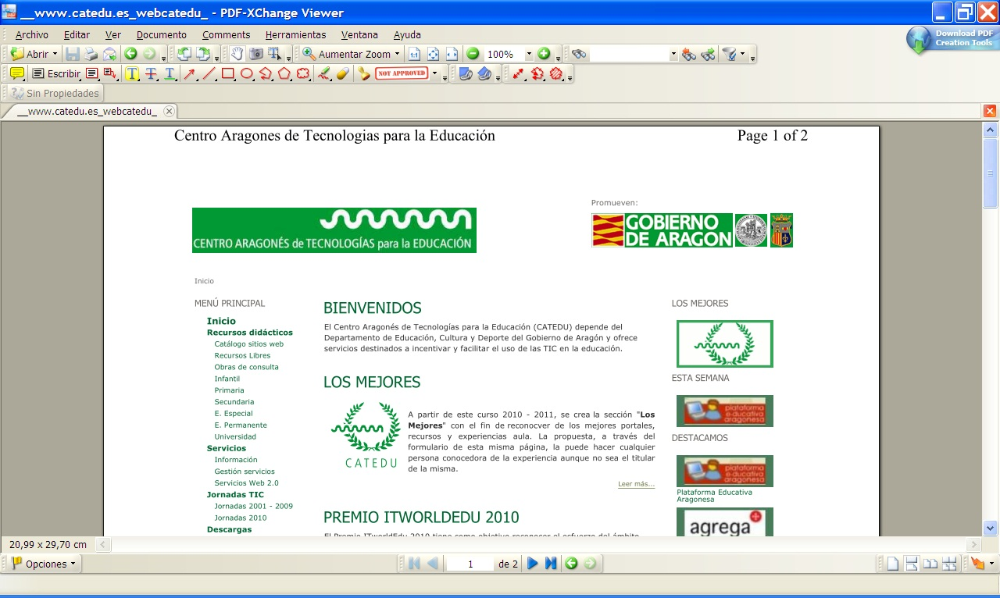

# 5.1. EL BOTÓN "IMPRIMIR" Y PDF CREATOR

Debemos recurrir a la opción Imprimir del menú Archivo tanto para Internet Explorer como Mozilla Firefox. En Google Chrome lo haremos pinchando en el icono  y seleccionando Imprimir. 

Entonces aparece una ventana bastante similar a la ventana de impresión de otros programas, pero con algunas peculiaridades propias. Veamos la utilidad de una de ellas, como puede ser la opción de hacer documentos en pdf.

Imagina que estás navegando en una web. Por ejemplo, vamos a ir al CATEDU.

 

 

Si pinchamos en Imprimir (Ctrl+P) podremos bien imprimirla en formato papel como se ve en la imagen como impresora predeterminada o bien podemos hacer que el contenido de esa web quede plasmada en un documento pdf generado por nosotros mismos. Para ello debemos seleccionar la impresora llamada **PDFCreator**.

 

 
Al darle al botón de imprimir nos aparece la siguiente pantalla donde podemos darle el título al pdf que estamos generando.

Posteriormente hacemos clic en guardar y seleccionamos la ubicación del archivo pdf. Recomendamos seleccionar el escritorio para un mejor acceso. 

 

 
Al abrir el pdf tenemos el contenido de la página principal del Catedu. Puedes comprobar que algún color de marcos se pierde. Esto sólo ocurre con las páginas web.

 

 

 

Puedes repetir este proceso para transformar en pdf todos los archivos de Office (.doc, .ppt, etc).

Si ahora mismo te estás preguntando dónde está mi impresora pdf creator es porque no estás delante de un Tablet Pc dentro del programa Pizarra Digital del Gobierno de Aragón. Este es un programa freeware, es decir, gratuito. Te dejo la URL en softonic para que te lo puedas descargar e instalar en tu ordenador.

[http://www.pdfforge.org/download](http://www.pdfforge.org/download) 

