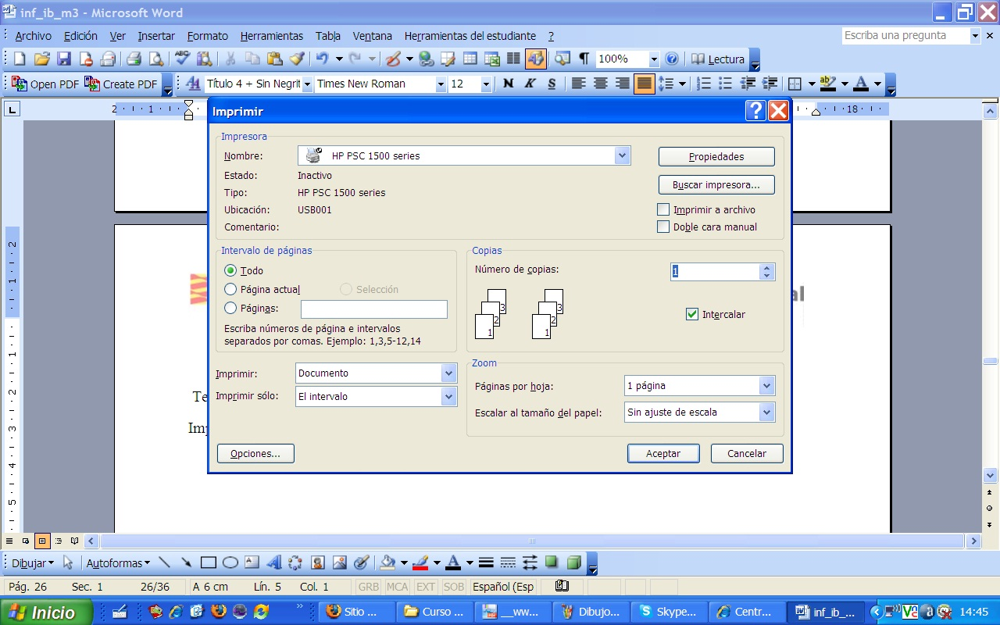
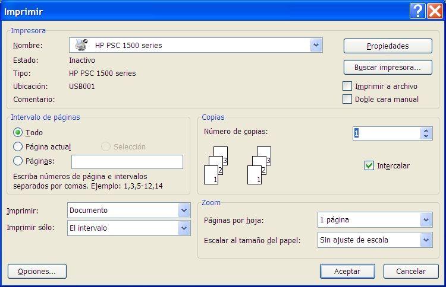

# 5.2. HACER UNA IMAGEN DE LA PANTALLA

Este es un pequeño truco que puede sernos muy útil. Quizás te has preguntado cómo hemos incluido en estos apuntes las imágenes que salen en nuestro ordenador. Es muy sencillo: ve a la tecla **Impr.Pant** que aparece en el teclado de tu ordenador; seguidamente abres Word y pulsas en Pegar y verás cómo te aparece una imagen de la pantalla de tu ordenador. En el caso de que quisieras hacer la imagen sólo de una de esas ventanas pequeñas que salen en lugar de pulsar Impr. Pant solamente, pulsa **Alt + Impr.Pant** y solo te saldrá la imagen de dicha ventana.

Ten en cuenta este pequeño truco porque tendrás que utilizarlo a lo largo del curso.

Impresión sólo dándole al botón Imp. Pant.

Fig 2.60. Imagen. Captura de pantalla.

 

Como puedes comprobar sale todo lo que tienes en ese momento en la pantalla. Si sólo quieres la ventana activa debes presionar a la vez el botón ALT + Imp. Pant. Te quedará la siguiente imagen.

 

Fig 2.61. Imagen 2. Captura de pantalla.

 

## Pregunta de Elección Múltiple

### Pregunta

¿Cómo se hace una imagen de la pantalla?

#### Respuestas

<label class="sr-av" for="i116_5">[Opción 1](#answer-116_5)</label><input id="i116_5" name="option116_2" onclick="$exe.getFeedback(0,3,'116_2','multi')" type="radio"/>

Pulsando en el botón Imp Pant del teclado y pegándolo en un documento word.

 

<label class="sr-av" for="i116_260">[Opción 2](#answer-116_260)</label><input id="i116_260" name="option116_2" onclick="$exe.getFeedback(1,3,'116_2','multi')" type="radio"/>

Pulsando además de Imp Pant la tecla Alt, si únicamente queremos hacer una imagen de la ventana que tenemos abierta.

<label class="sr-av" for="i116_263">[Opción 3](#answer-116_263)</label><input id="i116_263" name="option116_2" onclick="$exe.getFeedback(2,3,'116_2','multi')" type="radio"/>

Pulsando la tecla de Tab e Imp Pant.

#### Retroalimentación

¡Perfecto!

¡Bien hecho!

No, está opción no es correcta...

#### Solución

1. [Incorrecto](#answer-116_5) ([Retroalimentación](#sa0b116_2))
1. [Opción correcta](#answer-116_260) ([Retroalimentación](#sa1b116_2))
1. [Incorrecto](#answer-116_263) ([Retroalimentación](#sa2b116_2))

