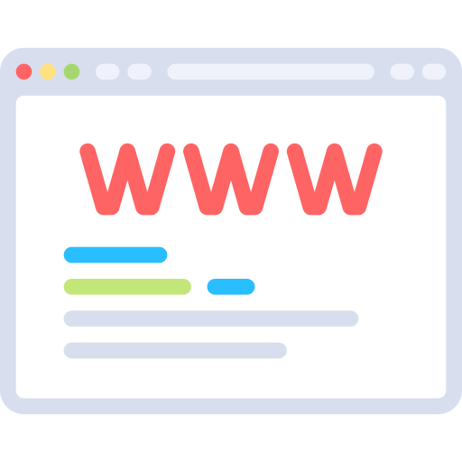

# Introducción

Con este curso se pretende que conozcas la web como doble herramienta: de localización de la información y de comunicación.

Desde el punto de vista de localización de información, tomaremos contacto con algunos conceptos básicos relacionados con Internet y que son importantes que conozcas. Posteriormente aprenderás el manejo básico de los navegadores y buscadores más utilizados actualmente, donde podrás navegar por diversas páginas educativas de gran interés.

Al finalizar el curso serás capaz de localizar aquellas páginas de Internet que contengan la información que necesitas.

En cuanto al enfoque como herramienta de comunicación, conocerás la utilidad del correo electrónico y de programas gestores tales como Outlook Express de Microsoft y Thunderbird de Mozilla.

Conocerás diferentes formas de cómo trabajar con la tecnología e internet en el aula (escuela 2.0), así como las principales redes sociales utilizadas en estos momentos y que son de gran utilidad en el ámbito educativo.

En todo momento se le ha dado al curso una orientación docente. La mayoría de ejemplos utilizados y de tareas exigidas están enfocados a que vayas descubriendo diferentes posibilidades de utilizar internet y como aplicarlo en el aula. El objetivo último del curso no es solo que conozcas el manejo de estas herramientas, sino que seas capaz de utilizarlas para mejorar tu práctica docente, motivando al alumno en el manejo de algunas de estas herramientas.

