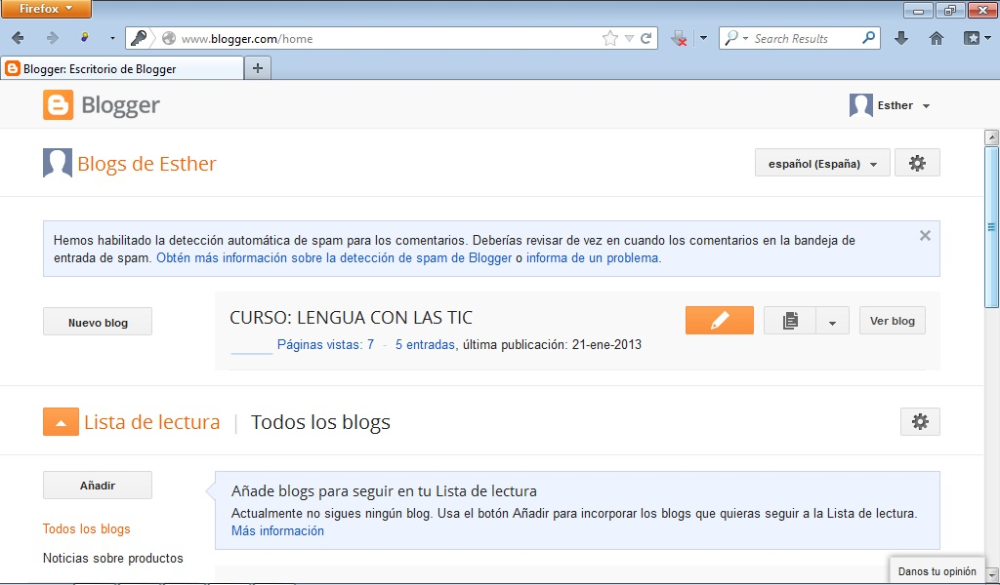

# Blogger

Blogger nos permite crear un blog de forma gratuita y sencilla.

El uso del blog en el aula es muy interesante puesto que supone un medio de comunicación extra con nuestros alumnos y familias. Además, mejora la motivación del alumnado hacia el aprendizaje. Podemos introducir tareas, fotos, comunicaciones, etc.

Para acceder a blogger debéis pinchar en: [https://accounts.google.com/](https://accounts.google.com/)

 

 4.25. Blogger. Captura de pantalla.

