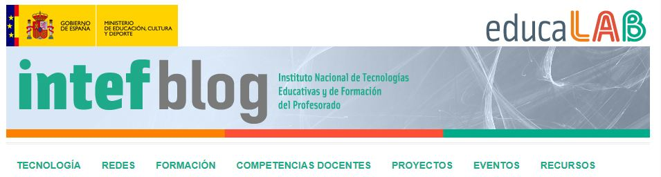

# Blogs

Resultan muy interesantes los blogs que aparecen en la portada del portal del INTEF:

*****[ Blog de INTEF](http://blog.educalab.es/intef/): Con interesantes artículos, estudios, reflexiones, consejos, orientaciones, recursos, etc. sobre la integración de las TIC en las aulas, el papel y competencias del profesorado, etc.

- 5-6- Blog INTEF- Captura de pantalla

 

***** [Blog INEE](http://blog.educalab.es/inee/): En él podemos encontrar información sobre evaluación educativa: indicadores, análisis o conclusiones de los informes de evaluación internacionales (PISA, OCDE), estudios y correlaciones entre diferentes variables educatias, estadísticas, etc.

 ***** [Blog CNIIE](http://blog.educalab.es/cniie/): En este blog hallaremos artículos sobre competencias básicas, calidad educativa, convivencia, apoyo educativo, emprendimiento,...

