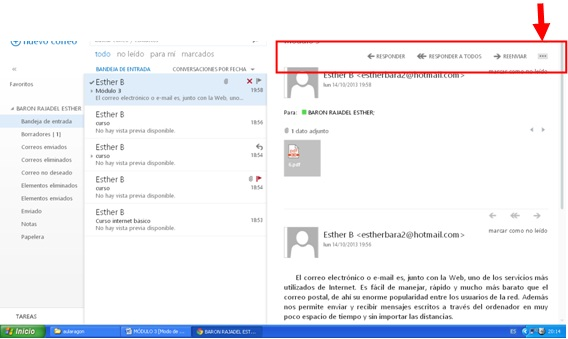
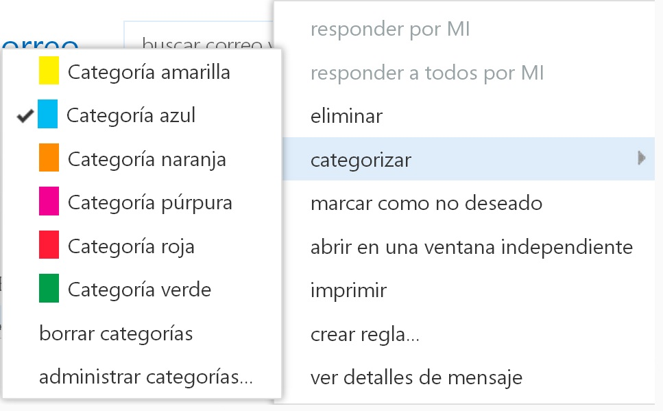
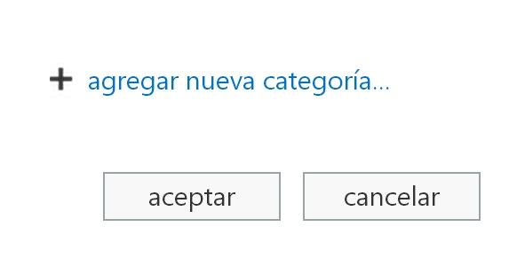
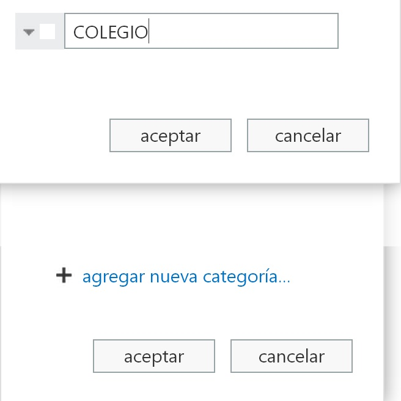
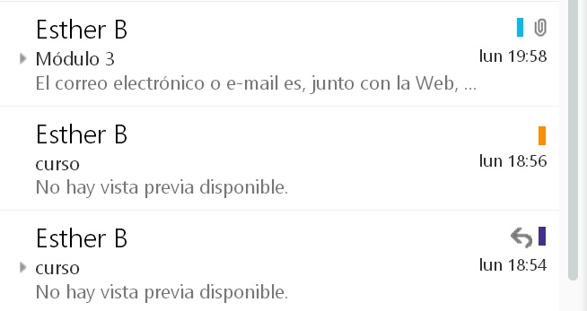

# Categorías

Esta es una opción muy interesante para mantener bien organizado nuestro correo. Cuando abrimos un correo para leerlo podemos observar que en la barra de herramientas superior nos aparecen tres puntos suspensivos.

 1.20. Categorías. Captura de pantalla.

 

Si pinchamos en ellos nos aparece la siguiente ventana.

 

 1.21. Administrar categorías. Captura de pantalla.

 

Si pinchamos en categorizar se nos da la opción de establecer una categoría al correo según colores o crear nuestra propia categoría mediante la opción **Administrar categorías**.

Al seleccionar administrar categorías se nos abre la siguiente ventana.

1.22. Agregar categorías. Captura de pantalla.

 

Seleccionaremos agregar nueva categoría. Pondremos el nombre que deseemos y seleccionaremos el color que queramos pinchando en el cuadro blanco que aparece a la izquierda del nombre de la categoría. Por último, le daremos a aceptar.

 

 1.23. Agregar categorías 2. Captura de pantalla.

De esta manera, observaremos que en la bandeja de entrada aparece en cada uno de los correos el color de la categoría que hemos asignado.

 

 1.24. Vista de categorías. Captura de pantalla.

 

