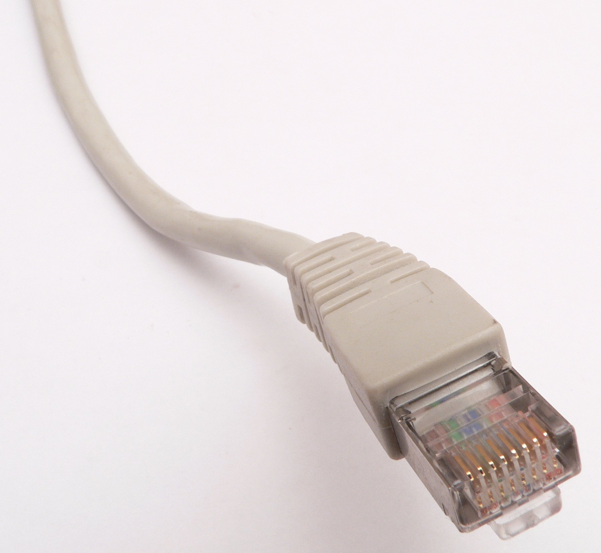

# Conexión

Fig. 1.21. Cable de red. Ethernet_RJ45_connector_p1160054. Fuente: [http://upload.wikimedia.org/wikipedia/commons/d/d7/Ethernet_RJ45_connector_p1160054.jpg](http://upload.wikimedia.org/wikipedia/commons/d/d7/Ethernet_RJ45_connector_p1160054.jpg)

 

**La comunicación entre nuestro ordenador e Internet necesita transportarse a través de algún medio físico**. Normalmente es a través de la línea telefónica pero en la actualidad la variedad es más amplia: cable, teléfono móvil, satélite, red eléctrica.... Algunas de estas están ya en marcha, otras se están empezando a comercializar y otras son solo proyectos.

Vamos ahora a explicar los tipos de conexión:

- **Red telefónica básica (RTB):** Hasta hace unos años era el sistema más utilizado, principalmente porque es el más barato y porque casi todos los lugares disponen de la línea telefónica básica. Es un sistema lento y no permite utilizar el teléfono mientras se está conectado a Internet. Para utilizar este sistema solo es necesario un MODEM, interno o externo. Estos modem suelen tener una velocidad de transferencia de 56 Kbps aunque casi nunca se consigue esa velocidad debido a la saturación de las líneas telefónicas convencionales. Su principal ventaja era que permite utilizar una infraestructura ya existente antes de su uso para Internet.

 

- **Red digital RDSI:** Este tipo de conexión también utiliza la línea telefónica pero mientras en el caso anterior la línea es analógica, en este caso la línea es digital, lo que se traduce en una transmisión más rápida. Pero esta conexión solo es posible en aquellos lugares donde existe una línea RDSI, ya que este tipo de línea no está extendida en todos los lugares. La línea RDSI dispone de dos canales, con lo cual se puede utilizar un canal para hablar por teléfono y el otro canal para Internet. Además su velocidad es de 128 Kbps. Para poder utilizarla en nuestras conexiones a Internet necesitamos que en el lugar en el estemos exista línea RDSI y además necesitamos una tarjeta RDSI interna. Actualmente está en desuso.

 

- **ADSL:** Es la conexión más habitual en este momento y son muchas las compañías que proporcionan conexiones ADSL a velocidades cada vez mayores. Este tipo de conexión utiliza la línea telefónica pero permite que los datos se transmitan de forma asimétrica. Hemos de tener en cuenta que cuando estamos conectados a Internet el flujo de datos es asimétrico, ya que la mayoría de estos datos van en sentido Internet a usuario mientras que en sentido contrario, usuario a Internet, van unos pocos. La conexión ADSL permite tener dos canales: uno mayor para los datos de Internet al usuario y otro menor en sentido contrario. Además otro canal permite que la línea telefónica quede libre para poder ser usada por el usuario. Sus ventajas son la velocidad (actualmente la oferta estándar suele ser 10 MB), la conexión permanente las 24 horas al día, que no se necesita marcar para conectarnos (simplemente con abrir el navegador ya estamos conectados a Internet) y que podemos hablar por teléfono a la vez que navegamos por la red. Es necesario un ROUTER, para la línea ADSL, que por lo general, suele ser inalámbrico y nos proporciona una conexión WiFi.

 

- **Fibra óptica:** Es otro de los tipos de conexión que más se está desarrollando .En lugar de utilizar la línea telefónica tradicional, este utiliza un cable de fibra óptica. Y este es su principal inconveniente: debemos vivir en un sitio en el que la compañía suministradora de cable lo haya instalado; generalmente, debe ser instalado completamente de nuevo excepto en aquellos lugares donde existía la televisión por cable. Una vez que la empresa haya hecho el cableado cualquier usuario interesado puede utilizar esta tecnología. Las ventajas son: una mayor velocidad, la posibilidad de utilizar este cable para hablar por teléfono y ver numerosos canales de televisión; otra ventaja es su precio (suele ser más barato). Tampoco es necesario marcar previamente para conectarse a Internet, basta con pinchar en el navegador para conectarse a Internet. Se necesita un MODEM especial suministrado por las propias compañías.

 

- **Teléfonos móviles:** Es lo más novedoso en lo que respecta a las conexiones a Internet. Desde hace unos años es posible conectarse a Internet a través del teléfono móvil, y de hecho, este tipo de conexiones son las que han experimentado un mayor aumento en un periodo corto de tiempo. La venta de terminales preparados para acceder a internet (smartphones) se ha disparado y las compañías ofrecen conexiones móviles cada vez más rápidas, tras la generalización del 3G se está empezando a ofrecer el 4G (de momento sólo en algunas ciudades). Podríamos decir que está en pleno desarrollo y que en un futuro será una de las opciones más extendidas.

 

- **Otro tipo de conexiones:** Otro tipo de conexiones son, por ejemplo, la conexión vía satélite, muy utilizada en centros rurales donde a las compañías no les es rentable la instalación de las líneas ADSL ni RDSI. La conexión vía satélite necesita una antena parabólica y un MODEM específico para satélite. Otro tipo de conexión pero que no está todavía en su fase comercial es la conexión a través de la red eléctrica. Este tipo de conexión es muy novedosa y presenta como gran ventaja el poder utilizar la red eléctrica que está presente en todos los lugares. En España, empresas como Endesa e Iberdrola están realizando pruebas con este nuevo sistema de conexión.

                          Fig. 1.22 Wifi. Fuente: [http://upload.wikimedia.org/wikipedia/commons/9/94/Wifi.png](http://upload.wikimedia.org/wikipedia/commons/9/94/Wifi.png) Licencia Creative Commons

