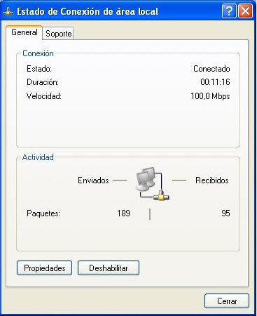
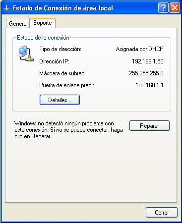
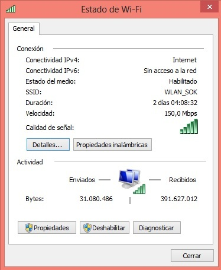
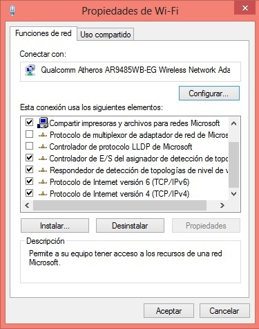
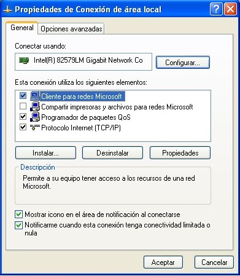
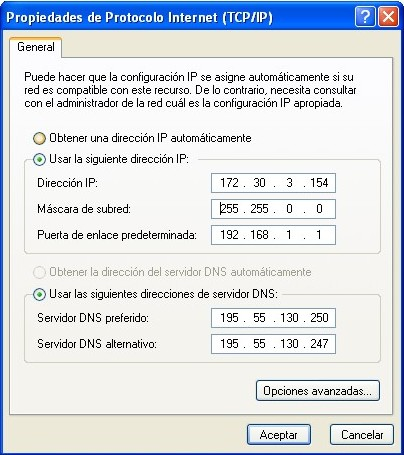
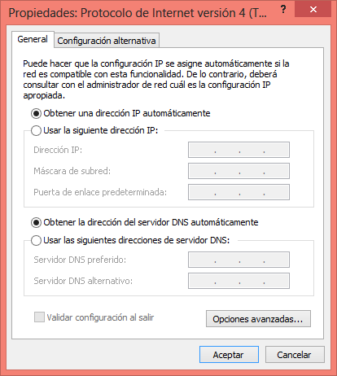

# Dirección IP y nombre de dominio

Todo ordenador conectado a la red Internet tiene que estar identificado de forma inequívoca con respecto al resto de ordenadores. Si no fuera así, no podrían comunicarse unos con otros. Es lo mismo que sucede con las direcciones postales o con los números de teléfono: han de ser únicos y exclusivos para cada usuario. **Los ordenadores conectados a Internet se identifican mediante lo que se denomina Dirección IP.**

Las [direcciones IP ](http://es.wikipedia.org/wiki/Direcci%C3%B3n_IP) están formadas por cuatro números separados por puntos, cada uno de los cuales puede tomar valores entre 0 y 255. Por ejemplo: 192.156.34.2.

Si estás conectado a Internet, tu equipo tendrá asignada una de estas direcciones IP- Para comprobarlo, desde un ordenador (con sistema operativo de Windows: XP, Vista o 7 has de seguir la siguiente ruta: Inicio--&gt; Mis sitios de red- En la columna de la izquierda, seleccionamos "Ver conexiones de red"- En el icono de un ordenador que nos aparece en la ventana, pulsamos con el botón derecho y seleccionamos "Estado"- En ese momento, nos aparece la siguiente ventana (1-4) si seleccionamos la pestaña compatibilidad nos aparece la IP como en la 1-5.

**Las IP pueden ser:**

- **Fijas (estáticas):** Se configuran manualmente en el dispositivo que se conecta a la red. El administrador de la red les asigna a cada ordenador una IP única, para distinguir a cada dispositivo de los demás que componen la red.

- **Dinámicas:** se configuran de manera automática y cambian cada vez que el dispositivo se desconecta y vuelve a conectarse a la red. La IP identifica a tu dispositivo mientras está conectado a Internet. El servidor de acceso le proporciona a ese ordenador de forma provisional (para esa sesión) una dirección IP de un rango que se reserva para ese fin. Cuando ese ordenador se desconecta, la dirección IP que se le adjudicó queda libre y puede volver a asignarse a otro usuario.

## ¿Cómo puedo saber cuál es mi IP?

En ocasiones, es importante y útil conocer nuestra dirección IP: para resolver problemas de conexión, para configurar una conexión nueva, etc.

En general, la **ruta para conocer la IP de nuestro ordenador** es similar en todos los equipos, independientemente de su sistema operativo (Windows XP, Vista, 7 u 8):

Incio--&gt; Panel de control --&gt;Redes e internet --&gt; Centro de redes y recursos compartidos --&gt; pinchar en el enlace que hay en la conexión y se abrirá una ventana similar a una de estas:

En la parte de "Actividad" pinchamos en "Propiedades" y se nos abre esta ventana:

Movemos hacia abajo el scroll de la parte central hasta que aparezca el elemento "Protocolo de Internet versión 4 (TCP/IPv4). Pinchamos encima de él y vemos como se activa, justo debajo de laparte central, el botón "Propiedades". Al princhar en dicho botón se abre una ventana nueva, en la que podemos ver qué tipo de IP estamos usando en nuestra conexión:

- **Estática** si está marcada la casilla "Usar la siguiente dirección IP". En este caso, aparecerán completos los campos: dirección IP, máscara subred y puerta de enlace predeterminada, además de las DNS.

- **Dinámica** en caso de que esté marcada la casilla "Obtener un IP automáticamente". Si es así, podemos observar que si desconectamos el equipo de Internet  lo volvemos a conectar, la dirección IP  (que habremos comprobado siguiendo la ruta de las instrucciones anteriores) ha variado.

Además de por la dirección IP, los ordenadores conectados a Internet pueden también identificarse por lo que se llama **Nombres de Dominio**[^1] . Los nombres de dominio son más fáciles de recordar que las direcciones IP y a través de su contenido  puede deducirse la situación geográfica del ordenador, a quién pertenece o el propósito del mismo.

De esta forma, a través de la dirección IP y del nombre de dominio, se completa el registro de un sitio en Internet.

Por ejemplo, el Servidor de la DGA (Diputación General de Aragón) está registrado en Internet con los siguientes datos:

- Dirección IP:** 195.55.130.250**
- Nombre de dominio: **aragon.es**

A su vez, el Servidor de la DGA puede dar paso a otros ordenadores pertenecientes a su misma red, dotándoles de otros nombres de dominio.

Por ejemplo, los ordenadores de la Red Educativa de la DGA tienen como nombre de dominio: **educa.aragon.es**, pero la dirección IP **debe ser la misma** que la asignada al servidor (195.55.130.250).

La primera palabra del nombre de dominio corresponde siempre al nombre del ordenador al que nos conectamos, en nuestro ejemplo, **.educa**. El resto de las palabras de ese nombre representan un subdominio que a su vez está comprendido en otro subdominio de alcance mayor, y así hasta la última palabra que corresponde al dominio principal o de primer nivel. En el ejemplo, **.es **corresponde al dominio principal y significa **España**.

[^1]: Los nombres de dominio junto con el protocolo DNS (Domain Name System) traducen las direcciones IP a términos más sencillos y prácticos para los usuarios. Por ejemplo: podemos acceder a http://aragon.es tecleando este nombre en el navegador, en lugar de tener que poner http://195.55.130.250

## Nombres de dominios

Por ejemplo, los ordenadores de la Red Educativa de la DGA tienen como nombre de dominio: **educa.aragon.es**, pero la dirección IP **debe ser la misma** que la asignada al servidor (195.55.130.250).

La primera palabra del nombre de dominio corresponde siempre al nombre del ordenador al que nos conectamos, en nuestro ejemplo, **.educa**. El resto de las palabras de ese nombre representan un subdominio que a su vez está comprendido en otro subdominio de alcance mayor, y así hasta la última palabra que corresponde al dominio principal o de primer nivel. En el ejemplo, **.es **corresponde al dominio principal y significa **España**.

- 1-12- Domain Name Extentions- Autor: Tristan- Fuente: http://www.flickr.com/photos/bloggingbookshelf/5910411419/ Licencia Creative Commons-

En la tabla siguiente aparecen algunos ejemplos de dominios principales de países:

| Alemania | Francia | Argentina | Reino Unido | Italia | China | México | Brasil | Rusia |
|:--------:|:-------:|:---------:|:-----------:|:------:|:-----:|:------:|:------:|:-----:|
|   .de    |   .fr   |    .ar    |     .uk     |  .it   |  .cn  |  .mx   |  .br   |  .ru  |

>**tip**
>## Para Saber Más
>
>- Listado de dominios de internet por países: [http://es.wikipedia.org/wiki/Anexo:Dominios_de_Internet#Lista_de_dominios_de_nivel_superior_geogr.C3.A1fico](http://es.wikipedia.org/wiki/Anexo:Dominios_de_Internet#Lista_de_dominios_de_nivel_superior_geogr.C3.A1fico)

## Conocimiento previo

Estados Unidos es una excepción a esta regla. El motivo es que Internet tuvo su origen histórico en las redes nacionales de ese país. En Estados Unidos los dominios de primer nivel hacen referencia al tipo de organización al que pertenece el ordenador. Los más utilizados son los siguientes:

| Educación | Empresa comercial | Entidad del gobierno | Recursos de la red | Militar | Otras organizaciones |
|:---------:|:-----------------:|:--------------------:|:------------------:|:-------:|:--------------------:|
|   .edu    |       .com        |         .gov         |        .net        |  .mil   |         .org         |

## Importante

Para conectarse con un ordenador Servidor (o remoto) y utilizar un determinado servicio de Internet, es necesario conocer la dirección IP o el nombre de dominio del ordenador que presta ese servicio.

**La dirección IP y el nombre de domino pueden utilizarse indistintamente para conectar con un ordenador remoto** porque, en el fondo, se conozca o no el número, detrás de cada nombre de dominio hay siempre una dirección IP.

## Actividad

Desde un ordenador conectado a Internet observa y comprueba las siguientes cuestiones:

-  ¿Cuál es la IP de tu equipo?

- ¿Cuál es la DNS?

- ¿Es una IP estática o dinámica?

- Desconecta el equipo de la red y vuélvelo a conectar. Comprueba, que en efecto, si tienes una IP estática, ésta se mantiene estable, y si la tienes dinámica, el servidor le ha asignado una nueva IP a tu equipo.
