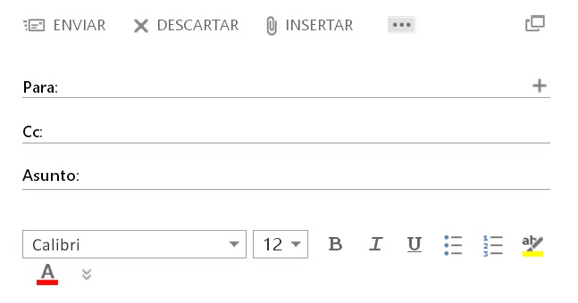
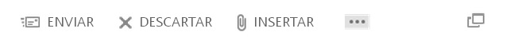
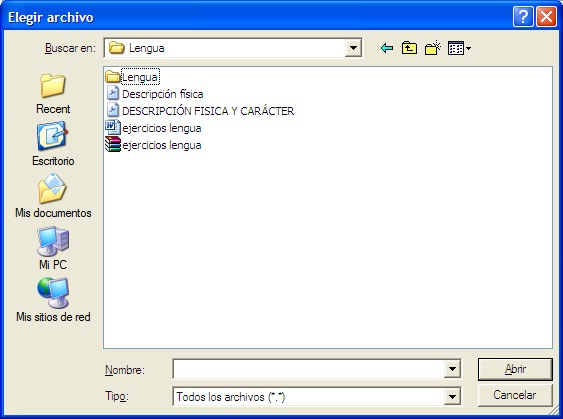
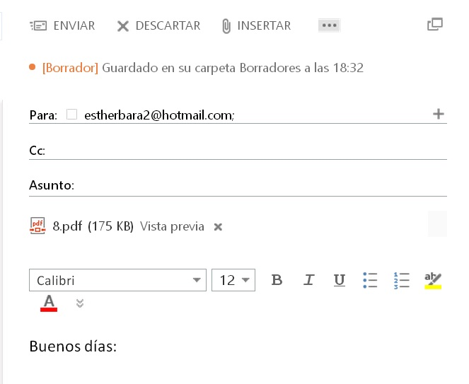
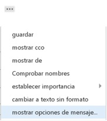

# Enviar correos

Si pulsamos en el icono "nuevo correo" podremos escribir un correo nuevo. La pantalla que nos aparece es la siguiente:

1.11. Envío de correos. Captura de pantalla.

 

En la pantalla nos aparecen tres líneas. La primera, **Para**, es el lugar en el que escribiremos la dirección del destinatario. Si pinchamos en el icono que tiene al lado **+** podremos seleccionar la dirección de entre las que tenemos guardadas en nuestra agenda de direcciones (más adelante explicaremos cómo construir nuestra agenda de direcciones).

Debajo tenemos la línea **CC**. Su nombre viene del inglés y significa papel carbón. En este lugar escribiremos las direcciones de todas las personas a las que deseamos mandar el correo además de la que hemos puesto en la línea Para.

Por último, nos aparece la línea **Asunto**. Esta línea es también casi obligatorio rellenarla, pues de esta forma podremos descubrir muchas veces, los mensajes que llevan virus de los que no. En esa línea escribiremos una palabra o una frase que identifique el motivo del mensaje.

Y, por último, tenemos una zona blanca, que es el lugar en el que escribiremos el cuerpo del mensaje.

Vemos que en la parte superior nos aparece la barra de herramientas con una serie de opciones.

1.12. Menú. Captura de pantalla.

 

**Enviar**: Pincharemos cuando hayamos acabado de escribir el email y queramos enviarlo.

**Descartar**: Esta opción la utilizaremos si decidimos no mandar ningún correo y queremos salir de esta pantalla.

**Insertar**: Para adjuntar aquellos archivos que queremos enviar al destinatario.

 

 1.13. Elegir archivo. Captura de pantalla.

 

Seleccionaremos el archivo que queramos adjuntar y pulsamos en el botón Abrir. Nos aparecerá esta otra ventana:

 1.14. Adjuntar archivo. Captura de pantalla.

 

Si pinchamos en** ... **se nos dan varias opciones:

 1.15. Opciones de mensaje. Captura de pantalla.

 

A continuación vamos a explicar algunas de estas opciones:

**Guardar**: El correo se guardaría en la carpeta de borradores.

**Mostrar CCO**: quiere decir papel carbón oculto. Hace el mismo efecto que CC, pero los destinatarios no ven las direcciones de las otras personas que, como ellos, han recibido el mismo mensaje. Es más correcto emplear ésta opción que la anterior, pues si los destinatarios VEN las direcciones de los otros destinatarios, puede haber alguno, que no desea decirle a otro cual es su dirección de correo, y con la opción CC, son reveladas todas las direcciones.

**Mostrad de**: Si pinchamos en esta opción se muestra nuestra dirección de correo electrónico (desde la cual estamos mandando el email).

 

