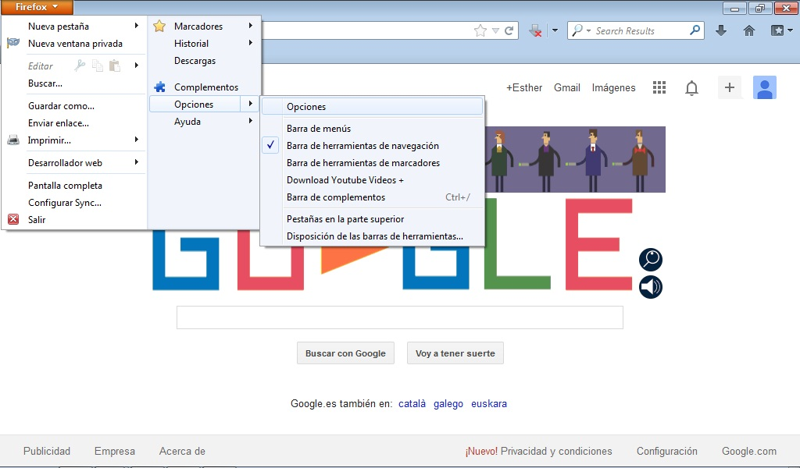

# Firefox de Mozilla

La página de inicio la podemos configurar de dos formas diferentes:

1. Si tenemos **activa** la barra de menús: Entrando en en el menú **Herramientas** --&gt; **Opciones.**** **

 Fig 2.17. Página de inicio. Captura de pantalla.

 

2. Si **no tenemos activa** la barra de menús: Pinchando en el botón de firefox que hay arriba a la izquierda. Seleccionaremos **Opciones** --&gt; **Opciones**.

 2.18. Página de inicio 2. Captura de pantalla.

 

En ambos casos se nos abrirá la siguiente ventana:

 Fig 2.19. General. Captura de pantalla.

 

Escribiremos la página que deseemos al lado de donde pone página de inicio.

Podremos elegir tres opciones:

- **Usar actual:** Si pinchamos en esta opción se asigna como página de inicio la que en ese momento está abierta en el navegador.

- **Usar marcador:** En este caso podemos elegir como inicio alguna de las páginas que tenemos asignadas como favoritas.

- **Restaurar al valor por omisión:** En este caso se asigna como inicio la página oficial de Mozilla Firefox.

