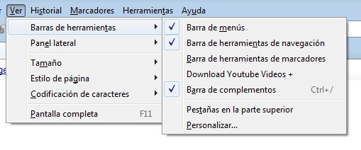
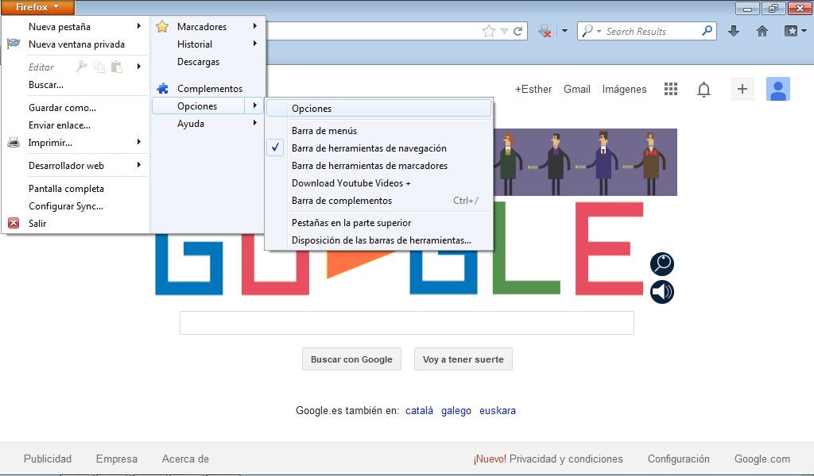

# Firefox de Mozilla

Para mostrar y ocultar las barras de herramientas en Firefox tendremos dos opciones:

1. Si tenemos **activa** la barra de menús: Pincharemos en **Ver** --&gt; **Barra de herramientas.**

	

2. Si **no tenemos activa** la barra de menús: Pincharemos en el botón de **firefox** situado arriba a la izquierda y seleccionaremos **opciones**. Desde aquí activaremos o desactivaremos las barras que queramos pinchando en el nombre.

## Reflexión

Abre el navegador accediendo a la página:  [****www.educaragon.org****](http://www.educaragon.org/) y despliega el menú Ver. Activa todas las barras de herramientas y observa cómo te limita la visualización de la página. Vuelve a abrir el menú Ver y desactiva todas las barras. Observa que ahora no puedes ni siquiera introducir la dirección de una página nueva. Por último, activa las barras para poder trabajar con comodidad.

%accordion%Solución%accordion%

Ten activas únicamente las barras de herramientas que sean necesarias para trabajar con comodidad.

%/accordion%

