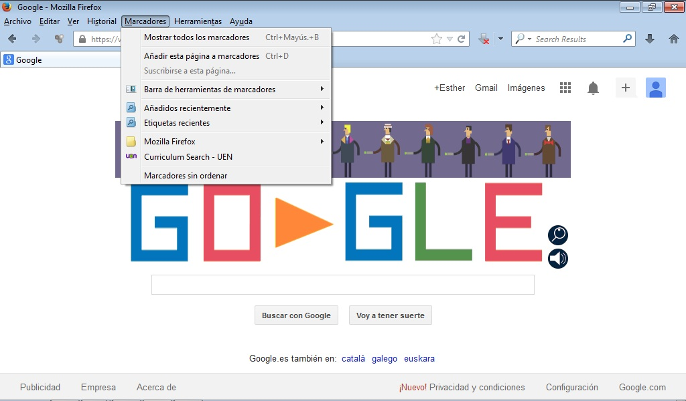
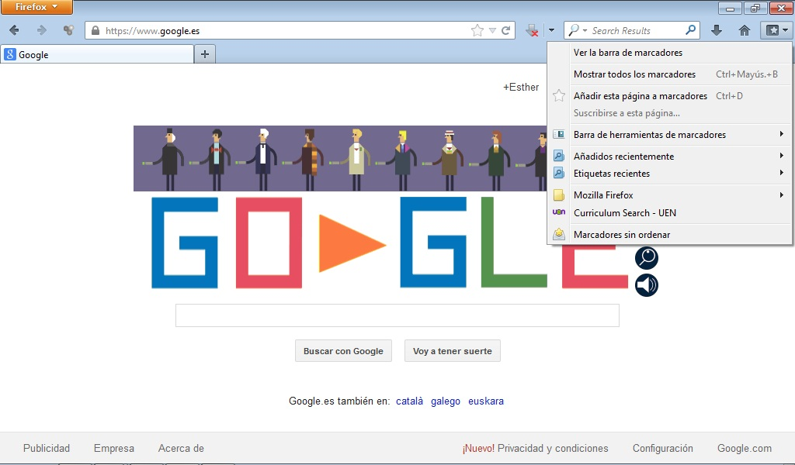
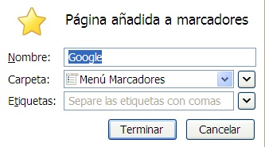
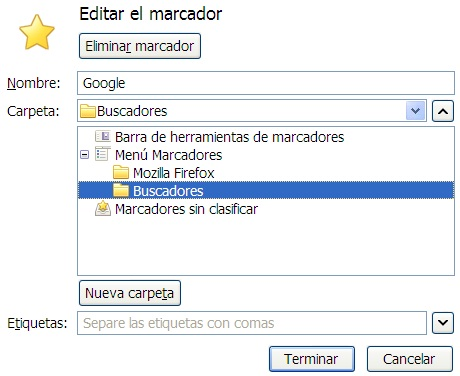
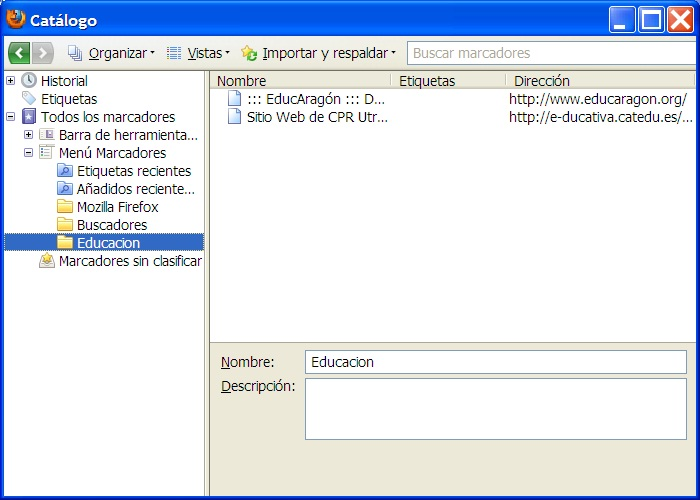

# Firefox de Mozilla

La utilización de este menú es la siguiente: supongamos que la página que estamos visitando en estos momentos nos interesa por cualquier motivo y queremos guardar dicha dirección en nuestro ordenador para disponer de ella cuando lo creamos conveniente. Tenemos dos opciones:

1. Si está **activa** la barra de menús: Pincharemos en Marcadores.

	

2. Si** no está activa** la barra de menús:  Pincharemos el **icono** que contiene una **estrella** situado a la **derecha**.

Si queremos añadir una web a marcadores una vez esté abierta seleccionaremos la opción **Añadir esta página a marcadores**.

Por defecto aparecerá en la carpeta marcadores. Pero también se pueden crear subcarpetas. Para ello abriremos la pestaña de la opción **Carpeta** y seleccionaremos **Elegir**.

Entonces tendremos la posibilidad de crear subcarpetas con nombres. En este caso crearemos una nueva carpeta y le pondremos el nombre de buscadores para meter la web de google en la misma. Repetiremos el mismo proceso y crearemos otra carpeta llamada Educación. 

Cuando queramos guardar otra web podremos repetir el proceso anterior o bien aprovechar las carpetas ya creadas. 

Una vez están creadas todas las carpetas con sus respectivos marcadores podremos moverlos u organizarlos simplemente con arrastrarlos desde el **Menu Marcadores – Mostrar todos los Marcadores.** Se nos abrirá un catálogo. Debemos desplegar el Menú Marcadores para ver las carpetas que hemos creado con sus correspondientes web.

Tanto si queremos eliminar una carpeta como una web de marcadores será tan sencillo como seleccionar la misma y con el botón derecho del ratón elegir dicha opción.

