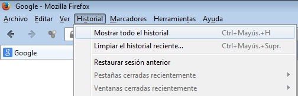
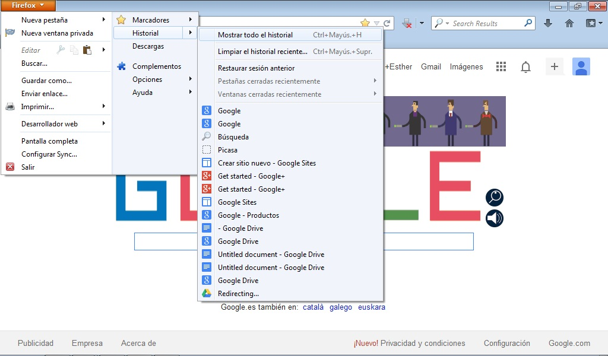
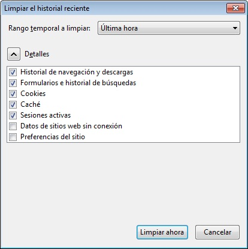

# Firefox de Mozilla

Para acceder al Historial tenemos dos opciones:

1. Si tenemos activa la barra de menús: Pinchamos en **Historial** situado en la barra de menús.

 

Fig 2.48. Historial. Captura de pantalla.

 

2. Si **no tenemos activa** la barra de menús: Pinchando en el icono de **firefox** situado arriba a la izquierda y seleccionando **historial**.

 

Fig 2.49. Historial 2. Captura de pantalla.

Desde cualquiera de las dos opciones podremos:

- Mostrar todo el historial.
- Limpiar el historial reciente.

 

Si seleccionamos **limpiar el historial reciente**, nos aparecerá la siguiente ventana.

 

Fig. 2.50. Historial 3. Captura de pantalla.

 

Si pinchamos en **detalles** podremos seleccionar aquello que queremos eliminar. Si pinchamos en **rango** **temporal a limpiar **seleccionaremos si queremos limpiar todo o aquello que sea de última hora, de hace dos horas, etc.

Finalmente, pincharemos en** limpiar ahora** y se eliminará todo aquellos que hayamos seleccionado.

 

