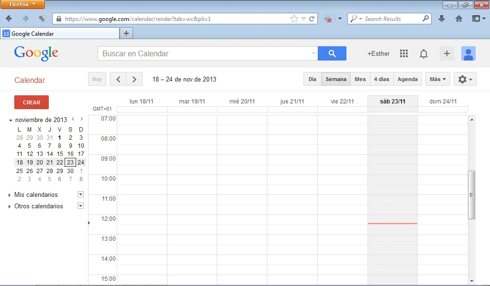

# Google Calendar

Una agenda electrónica para verla on line desde cualquier ordenador con conexión a Internet y poder publicarla en una web para hacerla pública o privada. 

Podemos acceder a Google Calendar pinchando en: [https://accounts.google.com/](https://accounts.google.com/)

 

 
>**tip**
>## Para Saber Más
>
>Para conocer el funcionamiento de Google Calendar visualiza el siguiente videotutorial.
>
> 
>
>
>https//www.youtube.com/watch?v=dOpqRr818xM

