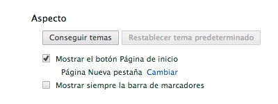

# Google Chrome

Selecciona **Configuración**.

- **Cómo añadir el botón de página de inicio a la barra de herramientas del navegador.**  El botón de página de inicio está desactivado de forma predeterminada. Selecciona la casilla de verificación "Mostrar el botón Página de inicio" de la sección "Aspecto" para mostrarlo en la barra de herramientas del navegador.

- **Cómo configurar la página de inicio.**  Si la casilla de verificación "Mostrar el botón Página de inicio" está seleccionada, aparecerá una dirección web debajo de ella. Si quieres que el botón de página de inicio abra otra página web, haz clic en **Cambiar** para introducir un enlace. También puedes seleccionar la [página Nueva pestaña](https://support.google.com/chrome/answer/answer.py?answer=95451) como la página de inicio.

Fig 2.20. Aspecto. Captura de pantalla.

 

