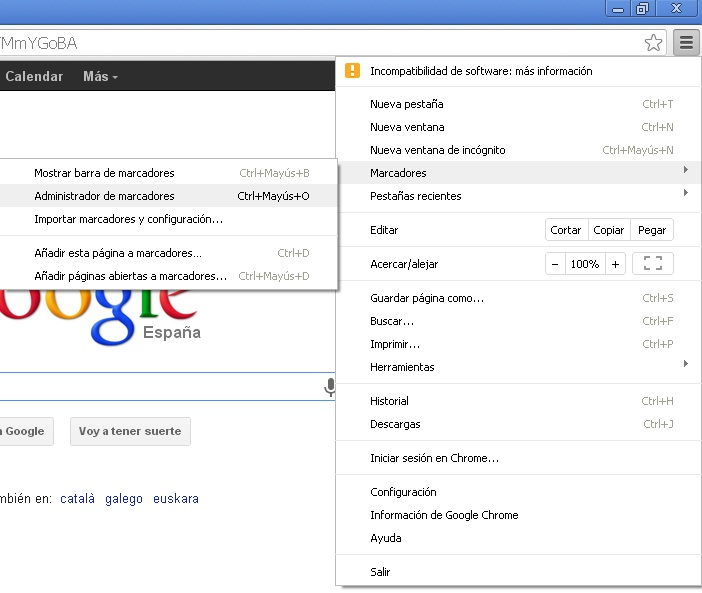
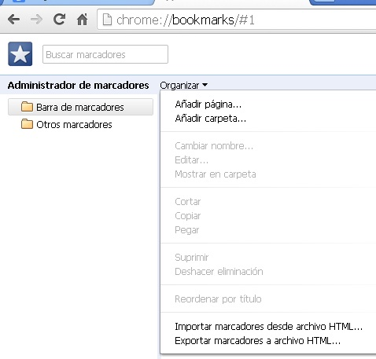

# Google Chrome

- Selecciona **Marcadores**.

- Selecciona **Administrador de marcadores**.

 

Fig 2.46. Marcadores. Captura de pantalla.

 

Desde aquí podemos añadir las páginas que deseemos a marcadores.

Seleccionando Organizar podemos añadir carpetas o páginas a marcadores.

 

Fig 2.47. Marcadores 2. Captura de pantalla.

## ParaSaberMas

Puedes sincronizar el listado de favoritos / marcadores en diferentes ordenadores. Para conocer cómo realizarlo consulta la siguiente página: 

[https://support.mozilla.org/es/kb/compartir-marcadores-pestanas-y-mucho-mas-con-tus-](https://support.mozilla.org/es/kb/compartir-marcadores-pestanas-y-mucho-mas-con-tus-)

