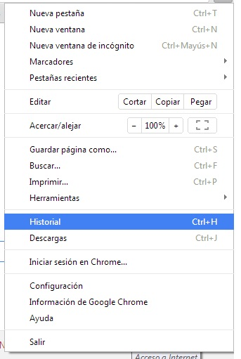
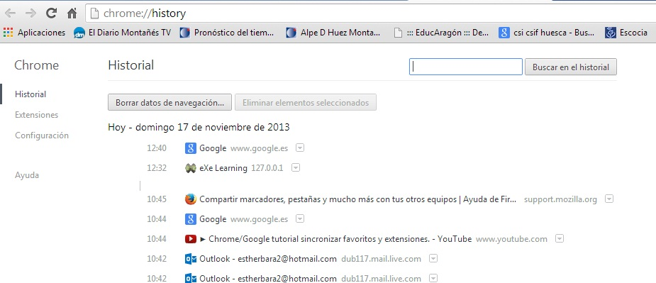
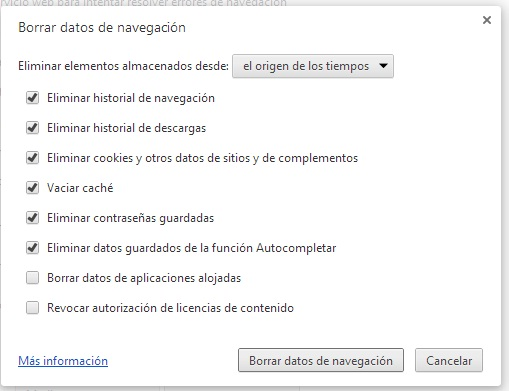

# Google Chrome

 

 

 2.51. Historial. Captura de pantalla.

 

 2.52. Historial 2. Captura de pantalla.

 

Tendremos **dos opciones**: 

- Borrar los datos de navegación. Pinchando aquí quedará todo eliminado.
- Eliminar elementos seleccionados: Podemos eliminar únicamente las páginas que deseemos simplemente seleccionándolas. 

 

 Si seleccionamos **borrar los datos de navegación**, se abrirá la siguiente ventana.

 

 2.53. Historial 3. Captura de pantalla.

 

Desde esta ventana podremos seleccionar aquellos elementos que queremos eliminar: historial, cookies, contraseñas, etc. Seleccionaremos lo que deseemos y pincharemos en **borrar datos de navegación**.

## Pregunta Verdadero-Falso

Selecciona si son verdaderas o falsas las siguientes afirmaciones.

### Pregunta 1

La navegación **off-line** se puede llevar a cabo gracias al almacenamiento temporal en nuestro ordenador de los archivos correspondientes a las páginas visitadas.

<label for="true0b114"><input id="true0b114" name="option0b114" onclick="$exe.getFeedback(0,2,'0b114','truefalse')" type="radio"/> Verdadero</label>
<label for="false0b114"><input id="false0b114" name="option0b114" onclick="$exe.getFeedback(1,2,'0b114','truefalse')" type="radio"/> Falso</label>

#### Retroalimentación

**Verdadero**

### Pregunta 2

**Internet Explorer** cuenta con un sistema de control del espacio en disco que ocupan las páginas visitadas. Este sistema permite que, de forma automática y según los criterios que nosotros introduzcamos, las páginas se vayan borrando para dar paso a otras nuevas sin necesidad de ocupar nuevo espacio.

<label for="true1b114"><input id="true1b114" name="option1b114" onclick="$exe.getFeedback(0,2,'1b114','truefalse')" type="radio"/> Verdadero</label>
<label for="false1b114"><input id="false1b114" name="option1b114" onclick="$exe.getFeedback(1,2,'1b114','truefalse')" type="radio"/> Falso</label>

#### Retroalimentación

**Verdadero**

### Pregunta 3

Cuando accedemos al historial, se nos permite consultar los datos de navegación pero en ningún caso eliminarlos. 

#### Sugerencia

Cuando accedemos al historial, se nos permite consultar los datos de navegación y también eliminarlos. 

<label for="true2b114"><input id="true2b114" name="option2b114" onclick="$exe.getFeedback(0,2,'2b114','truefalse')" type="radio"/> Verdadero</label>
<label for="false2b114"><input id="false2b114" name="option2b114" onclick="$exe.getFeedback(1,2,'2b114','truefalse')" type="radio"/> Falso</label>

#### Retroalimentación

**Falso**

