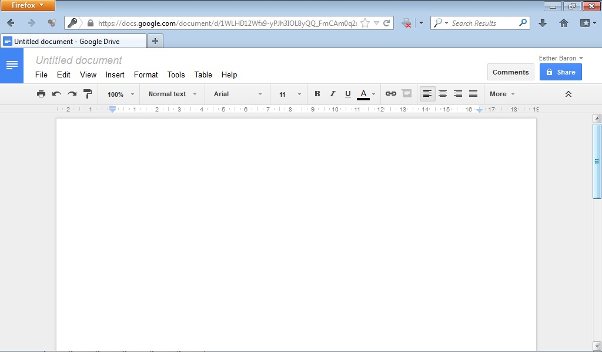

# Google Docs

Google docs permite crear y compartir tus hojas de cálculo, tus presentaciones y tus documentos online.

Es una herramienta muy interesante para el trabajo cooperativo en el aula ya que nos permite crear documentos de manera compartida.

Para acceder a Google Docs pincha en: [https://accounts.google.com/](https://accounts.google.com/)

 

Fig 4.27. Google Docs. Captura de pantalla.

 

